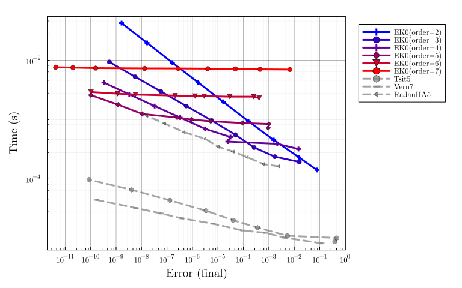

# Lotka-Volterra benchmark

Adapted from
[SciMLBenchmarks.jl](https://docs.sciml.ai/SciMLBenchmarksOutput/stable/NonStiffODE/LotkaVolterra_wpd/).

```julia
# Imports
using LinearAlgebra, Statistics
using StaticArrays, DiffEqDevTools, ParameterizedFunctions, Plots
using SciMLBase, OrdinaryDiffEq

using ProbNumDiffEq
```


```julia
# Plotting theme
theme(:dao;
    markerstrokewidth=0.5,
    legend=:outertopright,
    bottom_margin=5Plots.mm,
    size = (1000, 400),
)
```


```julia
f = @ode_def LotkaVolterra begin
  dx = a*x - b*x*y
  dy = -c*y + d*x*y
end a b c d
p = [1.5,1,3,1]
tspan = (0.0,10.0)
u0 = [1.0,1.0]
prob = ODEProblem{true, SciMLBase.FullSpecialize}(f, u0, tspan, p)

sol = solve(prob,Vern7(),abstol=1/10^14,reltol=1/10^14, dense=false)
test_sol = sol
plot(sol, title="Lotka-Volterra Solution", legend=false)
```




## EK0 accross orders

```julia
DENSE = false;
SAVE_EVERYSTEP = false;
```


```julia
_setups = [
  "EK0($order)" => Dict(:alg=>EK0(order=order, smooth=DENSE))
  for order in 1:10
]

labels = first.(_setups)
setups = last.(_setups)

abstols = 1.0 ./ 10.0 .^ (6:13)
reltols = 1.0 ./ 10.0 .^ (3:10)

wp = WorkPrecisionSet(
    prob, abstols, reltols, setups;
    names = labels,
    #print_names = true,
    appxsol = test_sol,
    dense = DENSE,
    save_everystep = SAVE_EVERYSTEP,
    numruns = 10,
    maxiters = Int(1e7),
    timeseries_errors = false,
    verbose = false,
)

plot(wp, palette=Plots.palette([:red, :blue], 10))
```


## EK1 accross orders

```julia
_setups = [
  "EK1($order)" => Dict(:alg=>EK1(order=order, smooth=DENSE))
  for order in 1:10
]

labels = first.(_setups)
setups = last.(_setups)

abstols = 1.0 ./ 10.0 .^ (6:13)
reltols = 1.0 ./ 10.0 .^ (3:10)

wp = WorkPrecisionSet(
    prob, abstols, reltols, setups;
    names = labels,
    #print_names = true,
    appxsol = test_sol,
    dense = DENSE,
    save_everystep = SAVE_EVERYSTEP,
    numruns = 10,
    maxiters = Int(1e7),
    timeseries_errors = false,
    verbose = false,
)

plot(wp, palette=Plots.palette([:red, :blue], 10))
```


