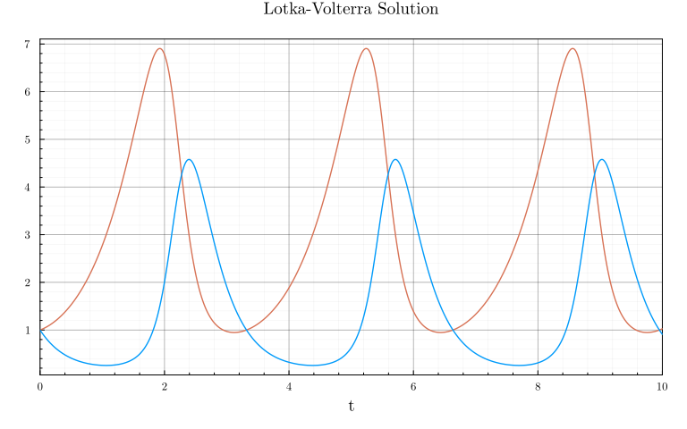
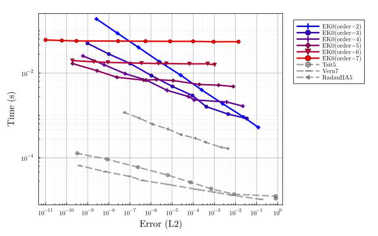
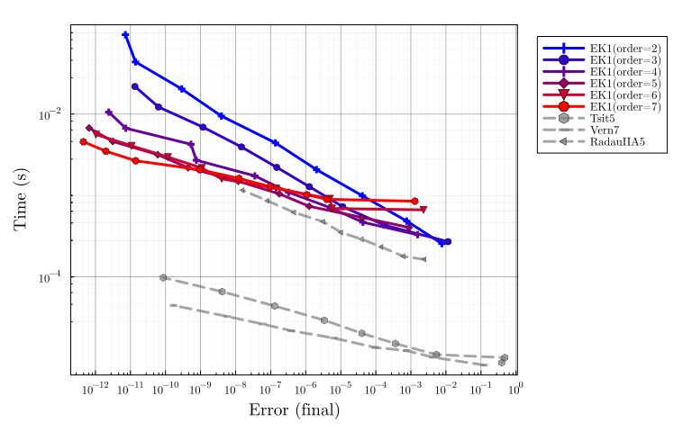
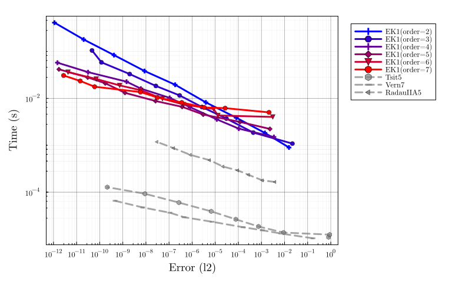

# Lotka-Volterra benchmark

Adapted from
[SciMLBenchmarks.jl](https://docs.sciml.ai/SciMLBenchmarksOutput/stable/NonStiffODE/LotkaVolterra_wpd/).

```julia
using LinearAlgebra, Statistics, InteractiveUtils
using DiffEqDevTools, ParameterizedFunctions, SciMLBase, OrdinaryDiffEq, Plots
using ProbNumDiffEq

# Plotting theme
theme(:dao;
    markerstrokewidth=0.5,
    legend=:outertopright,
    bottom_margin=5Plots.mm,
    size = (1000, 400),
)
```


### Lotka-Volterra problem definition

```julia
f = @ode_def LotkaVolterra begin
  dx = a*x - b*x*y
  dy = -c*y + d*x*y
end a b c d
p = [1.5, 1, 3, 1]
tspan = (0.0, 10.0)
u0 = [1.0, 1.0]
prob = ODEProblem{true, SciMLBase.FullSpecialize}(f, u0, tspan, p)

test_sol = solve(prob, Vern7(), abstol=1/10^14, reltol=1/10^14, dense=false)
plot(test_sol, title="Lotka-Volterra Solution", legend=false)
```




## EK0 accross orders

```julia
DENSE = false;
SAVE_EVERYSTEP = false;

_setups = [
  "EK0(order=$order)" => Dict(:alg => EK0(order=order, smooth=DENSE))
  for order in 1:10
]

labels = first.(_setups)
setups = last.(_setups)

abstols = 1.0 ./ 10.0 .^ (4:13)
reltols = 1.0 ./ 10.0 .^ (1:10)

wp = WorkPrecisionSet(
    prob, abstols, reltols, setups;
    names = labels,
    #print_names = true,
    appxsol = test_sol,
    dense = DENSE,
    save_everystep = SAVE_EVERYSTEP,
    numruns = 10,
    maxiters = Int(1e7),
    timeseries_errors = false,
    verbose = false,
)

plot(wp, palette=Plots.palette([:blue, :red], 10), xticks = 10.0 .^ (-16:1:5))
```


## EK1 accross orders

```julia
DENSE = false;
SAVE_EVERYSTEP = false;

_setups = [
  "EK1(order=$order)" => Dict(:alg => EK1(order=order, smooth=DENSE))
  for order in 1:10
]

labels = first.(_setups)
setups = last.(_setups)

abstols = 1.0 ./ 10.0 .^ (4:13)
reltols = 1.0 ./ 10.0 .^ (1:10)

wp = WorkPrecisionSet(
    prob, abstols, reltols, setups;
    names = labels,
    #print_names = true,
    appxsol = test_sol,
    dense = DENSE,
    save_everystep = SAVE_EVERYSTEP,
    numruns = 10,
    maxiters = Int(1e7),
    timeseries_errors = false,
    verbose = false,
)

plot(wp, palette=Plots.palette([:blue, :red], 10), xticks = 10.0 .^ (-16:1:5))
```


## EK0 vs. EK1

```julia
DENSE = false;
SAVE_EVERYSTEP = false;

_setups = [
  "EK0(order=2)" => Dict(:alg => EK0(order=2, smooth=DENSE))
  "EK0(order=3)" => Dict(:alg => EK0(order=3, smooth=DENSE))
  "EK0(order=4)" => Dict(:alg => EK0(order=4, smooth=DENSE))
  "EK0(order=5)" => Dict(:alg => EK0(order=5, smooth=DENSE))
  "EK1(order=2)" => Dict(:alg => EK1(order=2, smooth=DENSE))
  "EK1(order=3)" => Dict(:alg => EK1(order=3, smooth=DENSE))
  "EK1(order=4)" => Dict(:alg => EK1(order=4, smooth=DENSE))
  "EK1(order=5)" => Dict(:alg => EK1(order=5, smooth=DENSE))
]

labels = first.(_setups)
setups = last.(_setups)

abstols = 1.0 ./ 10.0 .^ (4:14)
reltols = 1.0 ./ 10.0 .^ (1:11)

wp = WorkPrecisionSet(
    prob, abstols, reltols, setups;
    names = labels,
    #print_names = true,
    appxsol = test_sol,
    dense = DENSE,
    save_everystep = SAVE_EVERYSTEP,
    numruns = 10,
    maxiters = Int(1e7),
    timeseries_errors = false,
    verbose = false,
)

plot(wp, color=[1 1 1 1 2 2 2 2], xticks = 10.0 .^ (-16:1:5))
```




## DynamicDiffusion vs FixedDiffusion

```julia
DENSE = false;
SAVE_EVERYSTEP = false;

_setups = [
  "EK1(2) dynamic" => Dict(:alg => EK1(order=2, smooth=DENSE, diffusionmodel=DynamicDiffusion()))
  "EK1(3) dynamic" => Dict(:alg => EK1(order=3, smooth=DENSE, diffusionmodel=DynamicDiffusion()))
  "EK1(5) dynamic" => Dict(:alg => EK1(order=5, smooth=DENSE, diffusionmodel=DynamicDiffusion()))
  "EK1(2) fixed" => Dict(:alg => EK1(order=2, smooth=DENSE, diffusionmodel=FixedDiffusion()))
  "EK1(3) fixed" => Dict(:alg => EK1(order=3, smooth=DENSE, diffusionmodel=FixedDiffusion()))
  "EK1(5) fixed" => Dict(:alg => EK1(order=5, smooth=DENSE, diffusionmodel=FixedDiffusion()))
]

labels = first.(_setups)
setups = last.(_setups)

abstols = 1.0 ./ 10.0 .^ (4:15)
reltols = 1.0 ./ 10.0 .^ (1:12)

wp = WorkPrecisionSet(
    prob, abstols, reltols, setups;
    names = labels,
    #print_names = true,
    appxsol = test_sol,
    dense = DENSE,
    save_everystep = SAVE_EVERYSTEP,
    numruns = 10,
    maxiters = Int(1e7),
    timeseries_errors = false,
    verbose = false,
)

plot(wp, color=[2 2 2 3 3 3], xticks = 10.0 .^ (-16:1:5))
```




## TaylorModeInit vs ClassicSolverInit

```julia
DENSE = false;
SAVE_EVERYSTEP = false;

_setups = [
  "EK1(2) TaylorInit" => Dict(:alg => EK1(order=2, smooth=DENSE, initialization=TaylorModeInit()))
  "EK1(3) TaylorInit" => Dict(:alg => EK1(order=3, smooth=DENSE, initialization=TaylorModeInit()))
  "EK1(5) TaylorInit" => Dict(:alg => EK1(order=5, smooth=DENSE, initialization=TaylorModeInit()))
  "EK1(2) Tsit5Init" => Dict(:alg => EK1(order=2, smooth=DENSE, initialization=ClassicSolverInit()))
  "EK1(3) Tsit5Init" => Dict(:alg => EK1(order=3, smooth=DENSE, initialization=ClassicSolverInit()))
  "EK1(5) Tsit5Init" => Dict(:alg => EK1(order=5, smooth=DENSE, initialization=ClassicSolverInit()))
  "EK1(2) Tsit5Init+du" => Dict(:alg => EK1(order=2, smooth=DENSE, initialization=ClassicSolverInit(init_on_du=true)))
  "EK1(3) Tsit5Init+du" => Dict(:alg => EK1(order=3, smooth=DENSE, initialization=ClassicSolverInit(init_on_du=true)))
  "EK1(5) Tsit5Init+du" => Dict(:alg => EK1(order=5, smooth=DENSE, initialization=ClassicSolverInit(init_on_du=true)))
]

labels = first.(_setups)
setups = last.(_setups)

abstols = 1.0 ./ 10.0 .^ (4:15)
reltols = 1.0 ./ 10.0 .^ (1:12)

wp = WorkPrecisionSet(
    prob, abstols, reltols, setups;
    names = labels,
    #print_names = true,
    appxsol = test_sol,
    dense = DENSE,
    save_everystep = SAVE_EVERYSTEP,
    numruns = 10,
    maxiters = Int(1e7),
    timeseries_errors = false,
    verbose = false,
)

plot(wp, color=[2 2 2 4 4 4 5 5 5], xticks = 10.0 .^ (-16:1:5))
```




## Conclusion

- **Use the EK1!** It seems to be strictly better than the EK0 here.
  Though note that by using ParameterizedFunctions.jl, the Jacobian of the vector field is available analytically.
- Orders behave as in classic solvers:
  Use low order for low accuracy, medium order for medium accuracy, high order for high accuracy.
- Most likely, the default choice of `diffusionmodel=DynamicDiffusion` and `initialization=TaylorModeInit` are fine.


## Appendix

Computer information:

```julia
InteractiveUtils.versioninfo()
```

```
Julia Version 1.8.5
Commit 17cfb8e65ea (2023-01-08 06:45 UTC)
Platform Info:
  OS: Linux (x86_64-linux-gnu)
  CPU: 12 × Intel(R) Core(TM) i7-6800K CPU @ 3.40GHz
  WORD_SIZE: 64
  LIBM: libopenlibm
  LLVM: libLLVM-13.0.1 (ORCJIT, broadwell)
  Threads: 12 on 12 virtual cores
Environment:
  JULIA_NUM_THREADS = auto
  JULIA_STACKTRACE_MINIMAL = true
```


