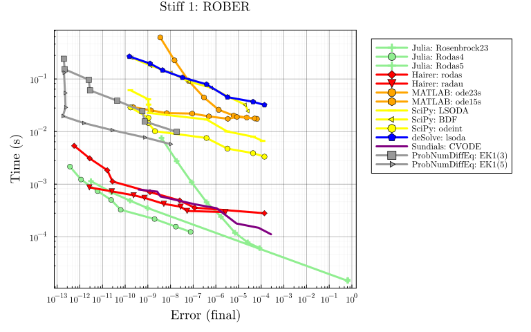
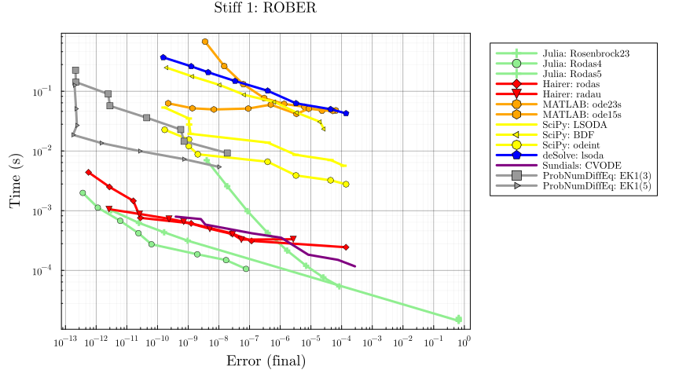
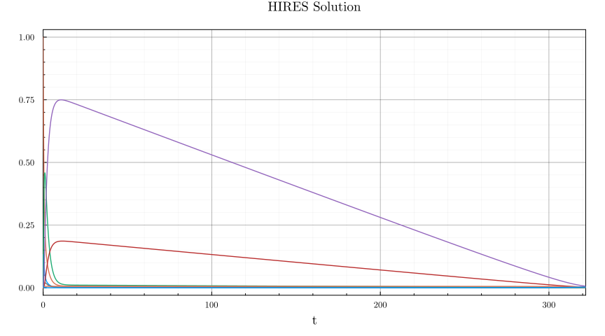
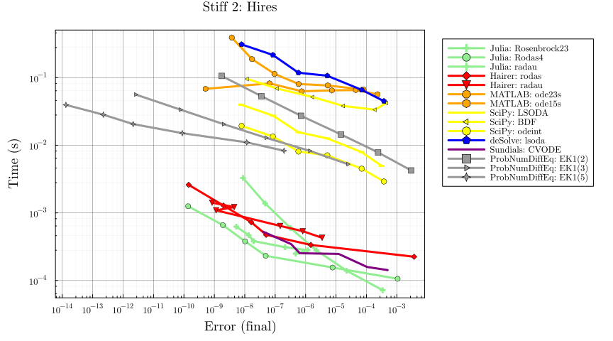

# ProbNumDiffEq.jl vs. various solver packages

Adapted from
[SciMLBenchmarks.jl multi-language wrapper benchmark](https://docs.sciml.ai/SciMLBenchmarksOutput/stable/MultiLanguage/ode_wrapper_packages/).

```julia
# Imports
using LinearAlgebra, Statistics
using StaticArrays, DiffEqDevTools, ParameterizedFunctions, Plots, SciMLBase, OrdinaryDiffEq
using ODEInterface, ODEInterfaceDiffEq, Sundials, SciPyDiffEq, deSolveDiffEq, MATLABDiffEq, LSODA
using LoggingExtras

using ProbNumDiffEq
```


```julia
# Plotting theme
theme(:dao;
    markerstrokewidth=0.5,
    legend=:outertopright,
    bottom_margin=5Plots.mm,
    size = (1000, 400),
    xticks = 10.0 .^ (-16:1:16),
    yticks = 10.0 .^ (-6:1:5),
)
```


```julia
# Constants used throughout this benchmark
const DENSE = false # used to decide if we smooth or not
const SAVE_EVERYSTEP = false;
```


```julia
COLORS = Dict(
    "Julia" => :LightGreen,
    "Julia (static)" => :DarkGreen,
    "Hairer" => :Red,
    "MATLAB" => :Orange,
    "SciPy" => :Yellow,
    "deSolve" => :Blue,
    "Sundials" => :Purple,
    "liblsoda" => :Purple,
    "ProbNumDiffEq: EK0" => :Gray30,
    "ProbNumDiffEq: EK1" => :Gray60,
)
tocolor(n) = if split(n, '(')[1] in keys(COLORS)
    COLORS[split(n, '(')[1]]
else
    COLORS[split(n, ':')[1]]
end
```

```
tocolor (generic function with 1 method)
```


```julia
deprecated_filter(log_args) = !contains(log_args.message, "deprecated")
filtered_logger = ActiveFilteredLogger(deprecated_filter, global_logger());
```


## Non-Stiff Problem 1: Lotka-Volterra

```julia
f = @ode_def LotkaVolterra begin
  dx = a*x - b*x*y
  dy = -c*y + d*x*y
end a b c d
p = [1.5, 1, 3, 1]
tspan = (0.0, 10.0)
u0 = [1.0, 1.0]
prob = ODEProblem{true,SciMLBase.FullSpecialize()}(f,u0,tspan,p)
staticprob = ODEProblem{false,SciMLBase.FullSpecialize()}(f,SVector{2}(u0),tspan,SVector{4}(p))

sol = solve(prob,Vern7(),abstol=1/10^14,reltol=1/10^14,dense=false)
test_sol = sol
plot(sol, title="Lotka-Volterra Solution", legend=false, xticks=:auto, yticks=:auto)
```


```julia
_setups = [
  "Julia: DP5" => Dict(:alg=>DP5())
  "Julia: Tsit5" => Dict(:alg=>Tsit5())
  "Julia: Vern7" => Dict(:alg=>Vern7())
  "Hairer: dopri5" => Dict(:alg=>ODEInterfaceDiffEq.dopri5())
  "MATLAB: ode45" => Dict(:alg=>MATLABDiffEq.ode45())
  "MATLAB: ode113" => Dict(:alg=>MATLABDiffEq.ode113())
  "SciPy: RK45" => Dict(:alg=>SciPyDiffEq.RK45())
  "SciPy: LSODA" => Dict(:alg=>SciPyDiffEq.LSODA())
  "SciPy: odeint" => Dict(:alg=>SciPyDiffEq.odeint())
  "deSolve: lsoda" => Dict(:alg=>deSolveDiffEq.lsoda())
  "deSolve: ode45" => Dict(:alg=>deSolveDiffEq.ode45())
  "Sundials: Adams" => Dict(:alg=>Sundials.CVODE_Adams())
  "ProbNumDiffEq: EK0(3)" => Dict(:alg=>EK0(order=3, smooth=DENSE))
  "ProbNumDiffEq: EK0(5)" => Dict(:alg=>EK0(order=5, smooth=DENSE))
  "ProbNumDiffEq: EK1(3)" => Dict(:alg=>EK1(order=3, smooth=DENSE))
  "ProbNumDiffEq: EK1(5)" => Dict(:alg=>EK1(order=5, smooth=DENSE))
  "ProbNumDiffEq: EK1(8)" => Dict(:alg=>EK1(order=8, smooth=DENSE))
]

labels = first.(_setups)
setups = last.(_setups)
colors = tocolor.(labels) |> permutedims

abstols = 1.0 ./ 10.0 .^ (6:13)
reltols = 1.0 ./ 10.0 .^ (3:10)

wp = with_logger(filtered_logger) do
    WorkPrecisionSet(
        [prob, staticprob], abstols, reltols, setups;
        names = labels,
        appxsol = [test_sol, test_sol],
        dense = DENSE,
        save_everystep = SAVE_EVERYSTEP,
        numruns = 10,
        maxiters = Int(1e7),
        timeseries_errors = false,
        verbose = false,
    )
end

plot(wp, title = "Non-stiff 1: Lotka-Volterra", color = colors)
```




## Non-Stiff Problem 2: Rigid Body

```julia
f = @ode_def RigidBodyBench begin
  dy1  = -2*y2*y3
  dy2  = 1.25*y1*y3
  dy3  = -0.5*y1*y2 + 0.25*sin(t)^2
end
u0 = [1.0;0.0;0.9]
tspan = (0.0, 10.0)
prob = ODEProblem{true,SciMLBase.FullSpecialize()}(f,u0,tspan)
staticprob = ODEProblem{false,SciMLBase.FullSpecialize()}(f,SVector{3}(u0),tspan)
sol = solve(prob,Vern7(),abstol=1/10^14,reltol=1/10^14,dense=false)
test_sol = sol
plot(sol, title="Rigid Body Solution", legend=false, xticks=:auto, yticks=:auto)
```


```julia
_setups = [
  "Julia: DP5" => Dict(:alg=>DP5())
  "Julia: Tsit5" => Dict(:alg=>Tsit5())
  "Julia: Vern7" => Dict(:alg=>Vern7())
  "Hairer: dopri5" => Dict(:alg=>dopri5())
  "MATLAB: ode45" => Dict(:alg=>MATLABDiffEq.ode45())
  "MATLAB: ode113" => Dict(:alg=>MATLABDiffEq.ode113())
  "SciPy: RK45" => Dict(:alg=>SciPyDiffEq.RK45())
  "SciPy: LSODA" => Dict(:alg=>SciPyDiffEq.LSODA())
  "SciPy: odeint" => Dict(:alg=>SciPyDiffEq.odeint())
  "deSolve: lsoda" => Dict(:alg=>deSolveDiffEq.lsoda())
  "deSolve: ode45" => Dict(:alg=>deSolveDiffEq.ode45())
  "Sundials: Adams" => Dict(:alg=>CVODE_Adams())
  "ProbNumDiffEq: EK0(3)" => Dict(:alg=>EK0(order=3, smooth=DENSE))
  "ProbNumDiffEq: EK0(5)" => Dict(:alg=>EK0(order=5, smooth=DENSE))
  "ProbNumDiffEq: EK1(3)" => Dict(:alg=>EK1(order=3, smooth=DENSE))
  "ProbNumDiffEq: EK1(5)" => Dict(:alg=>EK1(order=5, smooth=DENSE))
  "ProbNumDiffEq: EK1(8)" => Dict(:alg=>EK1(order=8, smooth=DENSE))
]

labels = first.(_setups)
setups = last.(_setups)
colors = tocolor.(labels) |> permutedims

abstols = 1.0 ./ 10.0 .^ (6:13)
reltols = 1.0 ./ 10.0 .^ (3:10)

wp = with_logger(filtered_logger) do
    WorkPrecisionSet(
        [prob,staticprob], abstols, reltols, setups;
        names = labels,
        appxsol = [test_sol, test_sol],
        dense = DENSE,
        save_everystep = SAVE_EVERYSTEP,
        numruns = 10,
        maxiters = Int(1e7),
        timeseries_errors = false,
        verbose = false
    )
end

plot(wp, title = "Non-stiff 2: Rigid-Body", color = colors)
```


## Stiff Problem 1: ROBER

```julia
rober = @ode_def begin
  dy₁ = -k₁*y₁+k₃*y₂*y₃
  dy₂ =  k₁*y₁-k₂*y₂^2-k₃*y₂*y₃
  dy₃ =  k₂*y₂^2
end k₁ k₂ k₃
u0 = [1.0,0.0,0.0]
p = [0.04,3e7,1e4]
prob = ODEProblem{true,SciMLBase.FullSpecialize()}(rober,u0,(0.0,1e5),p)
staticprob = ODEProblem{false,SciMLBase.FullSpecialize()}(rober,SVector{3}(u0),(0.0,1e5),SVector{3}(p))
sol = solve(prob,CVODE_BDF(),abstol=1/10^14,reltol=1/10^14,dense=false)
test_sol = sol
plot(sol, title="ROBER Solution", legend=false, xlims=(1e0, 1e5), xticks=:auto, yticks=:auto)
```



```julia
_setups = [
  "Julia: Rosenbrock23" => Dict(:alg=>Rosenbrock23())
  "Julia: Rodas4" => Dict(:alg=>Rodas4())
  "Julia: Rodas5" => Dict(:alg=>Rodas5())
  "Hairer: rodas" => Dict(:alg=>rodas())
  "Hairer: radau" => Dict(:alg=>radau())
  "MATLAB: ode23s" => Dict(:alg=>MATLABDiffEq.ode23s())
  "MATLAB: ode15s" => Dict(:alg=>MATLABDiffEq.ode15s())
  "SciPy: LSODA" => Dict(:alg=>SciPyDiffEq.LSODA())
  "SciPy: BDF" => Dict(:alg=>SciPyDiffEq.BDF())
  "SciPy: odeint" => Dict(:alg=>SciPyDiffEq.odeint())
  "deSolve: lsoda" => Dict(:alg=>deSolveDiffEq.lsoda())
  "Sundials: CVODE" => Dict(:alg=>CVODE_BDF())
  "ProbNumDiffEq: EK1(3)" => Dict(:alg=>EK1(order=3, smooth=DENSE))
  "ProbNumDiffEq: EK1(5)" => Dict(:alg=>EK1(order=5, smooth=DENSE))
]

labels = first.(_setups)
setups = last.(_setups)
colors = tocolor.(labels) |> permutedims

abstols = 1.0 ./ 10.0 .^ (5:12)
reltols = 1.0 ./ 10.0 .^ (2:9)

wp = with_logger(filtered_logger) do
    WorkPrecisionSet(
        [prob, staticprob], abstols, reltols, setups;
        names = labels,
        dense = DENSE,
        verbose = false,
        save_everystep = SAVE_EVERYSTEP,
        appxsol = [test_sol, test_sol],
        maxiters=Int(1e5)
    )
end

plot(wp, title = "Stiff 1: ROBER", color = colors)
```




## Stiff Problem 2: HIRES

```julia
f = @ode_def Hires begin
  dy1 = -1.71*y1 + 0.43*y2 + 8.32*y3 + 0.0007
  dy2 = 1.71*y1 - 8.75*y2
  dy3 = -10.03*y3 + 0.43*y4 + 0.035*y5
  dy4 = 8.32*y2 + 1.71*y3 - 1.12*y4
  dy5 = -1.745*y5 + 0.43*y6 + 0.43*y7
  dy6 = -280.0*y6*y8 + 0.69*y4 + 1.71*y5 -
           0.43*y6 + 0.69*y7
  dy7 = 280.0*y6*y8 - 1.81*y7
  dy8 = -280.0*y6*y8 + 1.81*y7
end

u0 = zeros(8)
u0[1] = 1
u0[8] = 0.0057
prob = ODEProblem{true,SciMLBase.FullSpecialize()}(f,u0,(0.0,321.8122))
staticprob = ODEProblem{false,SciMLBase.FullSpecialize()}(f,SVector{8}(u0),(0.0,321.8122))

sol = solve(prob,Rodas5(),abstol=1/10^14,reltol=1/10^14, dense=false)
test_sol = sol
plot(sol, title="HIRES Solution", legend=false, xticks=:auto, yticks=:auto)
```



```julia
_setups = [
  "Julia: Rosenbrock23" => Dict(:alg=>Rosenbrock23())
  "Julia: Rodas4" => Dict(:alg=>Rodas4())
  "Julia: radau" => Dict(:alg=>RadauIIA5())
  "Hairer: rodas" => Dict(:alg=>rodas())
  "Hairer: radau" => Dict(:alg=>radau())
  "MATLAB: ode23s" => Dict(:alg=>MATLABDiffEq.ode23s())
  "MATLAB: ode15s" => Dict(:alg=>MATLABDiffEq.ode15s())
  "SciPy: LSODA" => Dict(:alg=>SciPyDiffEq.LSODA())
  "SciPy: BDF" => Dict(:alg=>SciPyDiffEq.BDF())
  "SciPy: odeint" => Dict(:alg=>SciPyDiffEq.odeint())
  "deSolve: lsoda" => Dict(:alg=>deSolveDiffEq.lsoda())
  "Sundials: CVODE" => Dict(:alg=>CVODE_BDF())
  "ProbNumDiffEq: EK1(2)" => Dict(:alg=>EK1(order=2, smooth=DENSE))
  "ProbNumDiffEq: EK1(3)" => Dict(:alg=>EK1(order=3, smooth=DENSE))
  "ProbNumDiffEq: EK1(5)" => Dict(:alg=>EK1(order=5, smooth=DENSE))
]

labels = first.(_setups)
setups = last.(_setups)
colors = tocolor.(labels) |> permutedims

abstols = 1.0 ./ 10.0 .^ (5:10)
reltols = 1.0 ./ 10.0 .^ (1:6)

wp = with_logger(filtered_logger) do
    WorkPrecisionSet(
        [prob, staticprob], abstols, reltols, setups;
        names = labels,
        dense = false,
        verbose = false,
        save_everystep = false,
        appxsol = [test_sol, test_sol],
        maxiters = Int(1e5),
        numruns=100
    )
end

plot(wp, title = "Stiff 2: Hires", color=colors)
```


## Appendix

Computer information:
```julia
using InteractiveUtils
InteractiveUtils.versioninfo()
```

```
Julia Version 1.9.3
Commit bed2cd540a1 (2023-08-24 14:43 UTC)
Build Info:
  Official https://julialang.org/ release
Platform Info:
  OS: Linux (x86_64-linux-gnu)
  CPU: 12 × Intel(R) Core(TM) i7-6800K CPU @ 3.40GHz
  WORD_SIZE: 64
  LIBM: libopenlibm
  LLVM: libLLVM-14.0.6 (ORCJIT, broadwell)
  Threads: 12 on 12 virtual cores
Environment:
  JULIA_NUM_THREADS = auto
  JULIA_STACKTRACE_MINIMAL = true
```


Package Information:
```julia
using Pkg
Pkg.status()
```

```
Status `~/.julia/dev/ProbNumDiffEq/benchmarks/Project.toml`
  [f3b72e0c] DiffEqDevTools v2.39.1
  [7073ff75] IJulia v1.24.2
  [7f56f5a3] LSODA v0.7.5
  [e6f89c97] LoggingExtras v1.0.3
  [e2752cbe] MATLABDiffEq v1.2.0
  [961ee093] ModelingToolkit v8.72.2
  [54ca160b] ODEInterface v0.5.0
  [09606e27] ODEInterfaceDiffEq v3.13.3
  [1dea7af3] OrdinaryDiffEq v6.59.0
  [65888b18] ParameterizedFunctions v5.16.0
  [91a5bcdd] Plots v1.39.0
  [bf3e78b0] ProbNumDiffEq v0.13.0 `~/.julia/dev/ProbNumDiffEq`
  [0bca4576] SciMLBase v2.7.3
  [505e40e9] SciPyDiffEq v0.2.1
  [ce78b400] SimpleUnPack v1.1.0
  [90137ffa] StaticArrays v1.6.5
  [c3572dad] Sundials v4.20.1
  [44d3d7a6] Weave v0.10.12
  [0518478a] deSolveDiffEq v0.1.1
```


And the full manifest:
```julia
Pkg.status(mode=Pkg.PKGMODE_MANIFEST)
```

```
Status `~/.julia/dev/ProbNumDiffEq/benchmarks/Manifest.toml`
  [47edcb42] ADTypes v0.2.4
⌅ [c3fe647b] AbstractAlgebra v0.32.5
  [621f4979] AbstractFFTs v1.5.0
  [1520ce14] AbstractTrees v0.4.4
  [79e6a3ab] Adapt v3.7.1
  [ec485272] ArnoldiMethod v0.2.0
  [c9d4266f] ArrayAllocators v0.3.0
  [4fba245c] ArrayInterface v7.5.1
  [6e4b80f9] BenchmarkTools v1.3.2
  [e2ed5e7c] Bijections v0.1.6
  [d1d4a3ce] BitFlags v0.1.7
  [62783981] BitTwiddlingConvenienceFunctions v0.1.5
  [fa961155] CEnum v0.5.0
  [2a0fbf3d] CPUSummary v0.2.4
  [00ebfdb7] CSTParser v3.3.6
  [49dc2e85] Calculus v0.5.1
  [324d7699] CategoricalArrays v0.10.8
  [d360d2e6] ChainRulesCore v1.18.0
  [fb6a15b2] CloseOpenIntervals v0.1.12
  [944b1d66] CodecZlib v0.7.3
  [35d6a980] ColorSchemes v3.24.0
  [3da002f7] ColorTypes v0.11.4
  [c3611d14] ColorVectorSpace v0.10.0
  [5ae59095] Colors v0.12.10
  [861a8166] Combinatorics v1.0.2
  [a80b9123] CommonMark v0.8.12
  [38540f10] CommonSolve v0.2.4
  [bbf7d656] CommonSubexpressions v0.3.0
  [34da2185] Compat v4.10.0
  [b152e2b5] CompositeTypes v0.1.3
  [2569d6c7] ConcreteStructs v0.2.3
  [f0e56b4a] ConcurrentUtilities v2.3.0
  [8f4d0f93] Conda v1.9.1
  [187b0558] ConstructionBase v1.5.4
  [d38c429a] Contour v0.6.2
  [587fd27a] CovarianceEstimation v0.2.9
  [adafc99b] CpuId v0.3.1
  [a8cc5b0e] Crayons v4.1.1
  [717857b8] DSP v0.7.9
  [9a962f9c] DataAPI v1.15.0
  [a93c6f00] DataFrames v1.6.1
  [864edb3b] DataStructures v0.18.15
  [e2d170a0] DataValueInterfaces v1.0.0
  [8bb1440f] DelimitedFiles v1.9.1
  [2b5f629d] DiffEqBase v6.138.1
  [459566f4] DiffEqCallbacks v2.33.1
  [f3b72e0c] DiffEqDevTools v2.39.1
  [77a26b50] DiffEqNoiseProcess v5.19.0
  [163ba53b] DiffResults v1.1.0
  [b552c78f] DiffRules v1.15.1
  [b4f34e82] Distances v0.10.10
  [31c24e10] Distributions v0.25.103
  [ffbed154] DocStringExtensions v0.9.3
⌅ [5b8099bc] DomainSets v0.6.7
  [fa6b7ba4] DualNumbers v0.6.8
  [7c1d4256] DynamicPolynomials v0.5.3
  [b305315f] Elliptic v1.0.1
  [4e289a0a] EnumX v1.0.4
  [f151be2c] EnzymeCore v0.6.3
  [6912e4f1] Espresso v0.6.1
  [460bff9d] ExceptionUnwrapping v0.1.9
  [d4d017d3] ExponentialUtilities v1.25.0
  [e2ba6199] ExprTools v0.1.10
  [c87230d0] FFMPEG v0.4.1
  [7a1cc6ca] FFTW v1.7.1
  [7034ab61] FastBroadcast v0.2.7
  [9aa1b823] FastClosures v0.3.2
  [442a2c76] FastGaussQuadrature v1.0.0
  [29a986be] FastLapackInterface v2.0.0
  [1a297f60] FillArrays v1.7.0
  [6a86dc24] FiniteDiff v2.21.1
  [53c48c17] FixedPointNumbers v0.8.4
  [59287772] Formatting v0.4.2
  [f6369f11] ForwardDiff v0.10.36
  [069b7b12] FunctionWrappers v1.1.3
  [77dc65aa] FunctionWrappersWrappers v0.1.3
  [d9f16b24] Functors v0.4.5
  [46192b85] GPUArraysCore v0.1.5
  [28b8d3ca] GR v0.72.10
  [43dcc890] GaussianDistributions v0.5.2
  [c145ed77] GenericSchur v0.5.3
  [c27321d9] Glob v1.3.1
  [86223c79] Graphs v1.9.0
  [42e2da0e] Grisu v1.0.2
⌅ [0b43b601] Groebner v0.4.4
  [d5909c97] GroupsCore v0.4.0
  [cd3eb016] HTTP v1.10.0
  [eafb193a] Highlights v0.5.2
  [3e5b6fbb] HostCPUFeatures v0.1.16
  [34004b35] HypergeometricFunctions v0.3.23
  [7073ff75] IJulia v1.24.2
  [615f187c] IfElse v0.1.1
  [d25df0c9] Inflate v0.1.4
  [842dd82b] InlineStrings v1.4.0
  [18e54dd8] IntegerMathUtils v0.1.2
  [8197267c] IntervalSets v0.7.8
  [41ab1584] InvertedIndices v1.3.0
  [92d709cd] IrrationalConstants v0.2.2
  [c8e1da08] IterTools v1.8.0
  [82899510] IteratorInterfaceExtensions v1.0.0
  [1019f520] JLFzf v0.1.6
  [692b3bcd] JLLWrappers v1.5.0
  [682c06a0] JSON v0.21.4
  [98e50ef6] JuliaFormatter v1.0.42
  [ccbc3e58] JumpProcesses v9.8.0
  [ef3ab10e] KLU v0.4.1
  [2c470bb0] Kronecker v0.5.4
  [ba0b0d4f] Krylov v0.9.4
  [7f56f5a3] LSODA v0.7.5
  [b964fa9f] LaTeXStrings v1.3.1
  [2ee39098] LabelledArrays v1.14.0
  [984bce1d] LambertW v0.4.6
  [23fbe1c1] Latexify v0.16.1
  [10f19ff3] LayoutPointers v0.1.15
  [50d2b5c4] Lazy v0.15.1
  [1d6d02ad] LeftChildRightSiblingTrees v0.2.0
  [d3d80556] LineSearches v7.2.0
  [7ed4a6bd] LinearSolve v2.17.1
  [2ab3a3ac] LogExpFunctions v0.3.26
  [e6f89c97] LoggingExtras v1.0.3
  [bdcacae8] LoopVectorization v0.12.166
  [10e44e05] MATLAB v0.8.4
  [e2752cbe] MATLABDiffEq v1.2.0
  [33e6dc65] MKL v0.6.1
  [d8e11817] MLStyle v0.4.17
  [1914dd2f] MacroTools v0.5.11
  [d125e4d3] ManualMemory v0.1.8
  [739be429] MbedTLS v1.1.7
  [442fdcdd] Measures v0.3.2
  [e1d29d7a] Missings v1.1.0
  [961ee093] ModelingToolkit v8.72.2
  [46d2c3a1] MuladdMacro v0.2.4
  [102ac46a] MultivariatePolynomials v0.5.2
  [ffc61752] Mustache v1.0.19
  [d8a4904e] MutableArithmetics v1.3.3
  [d41bc354] NLSolversBase v7.8.3
  [2774e3e8] NLsolve v4.5.1
  [77ba4419] NaNMath v1.0.2
⌅ [356022a1] NamedDims v0.2.50
  [8913a72c] NonlinearSolve v2.8.0
  [54ca160b] ODEInterface v0.5.0
  [09606e27] ODEInterfaceDiffEq v3.13.3
  [6fd5a793] Octavian v0.3.27
  [6fe1bfb0] OffsetArrays v1.12.10
  [4d8831e6] OpenSSL v1.4.1
  [429524aa] Optim v1.7.8
  [bac558e1] OrderedCollections v1.6.2
  [1dea7af3] OrdinaryDiffEq v6.59.0
  [90014a1f] PDMats v0.11.28
  [fe68d972] PSDMatrices v0.4.6
  [65ce6f38] PackageExtensionCompat v1.0.2
  [65888b18] ParameterizedFunctions v5.16.0
  [d96e819e] Parameters v0.12.3
  [69de0a69] Parsers v2.7.2
  [b98c9c47] Pipe v1.3.0
  [32113eaa] PkgBenchmark v0.2.12
  [ccf2f8ad] PlotThemes v3.1.0
  [995b91a9] PlotUtils v1.3.5
  [91a5bcdd] Plots v1.39.0
  [e409e4f3] PoissonRandom v0.4.4
  [f517fe37] Polyester v0.7.9
  [1d0040c9] PolyesterWeave v0.2.1
⌅ [f27b6e38] Polynomials v3.2.13
  [2dfb63ee] PooledArrays v1.4.3
  [85a6dd25] PositiveFactorizations v0.2.4
  [d236fae5] PreallocationTools v0.4.12
  [aea7be01] PrecompileTools v1.2.0
  [21216c6a] Preferences v1.4.1
  [08abe8d2] PrettyTables v2.2.8
  [27ebfcd6] Primes v0.5.4
  [bf3e78b0] ProbNumDiffEq v0.13.0 `~/.julia/dev/ProbNumDiffEq`
  [33c8b6b6] ProgressLogging v0.1.4
  [438e738f] PyCall v1.96.1
  [1fd47b50] QuadGK v2.9.1
  [6f49c342] RCall v0.13.18
  [74087812] Random123 v1.6.1
  [fb686558] RandomExtensions v0.4.4
  [e6cf234a] RandomNumbers v1.5.3
  [3cdcf5f2] RecipesBase v1.3.4
  [01d81517] RecipesPipeline v0.6.12
  [731186ca] RecursiveArrayTools v2.38.10
  [f2c3362d] RecursiveFactorization v0.2.20
  [189a3867] Reexport v1.2.2
  [05181044] RelocatableFolders v1.0.1
  [ae029012] Requires v1.3.0
  [ae5879a3] ResettableStacks v1.1.1
  [79098fc4] Rmath v0.7.1
  [47965b36] RootedTrees v2.19.2
  [7e49a35a] RuntimeGeneratedFunctions v0.5.12
  [fdea26ae] SIMD v3.4.6
  [94e857df] SIMDTypes v0.1.0
  [476501e8] SLEEFPirates v0.6.42
  [0bca4576] SciMLBase v2.7.3
  [e9a6253c] SciMLNLSolve v0.1.9
  [c0aeaf25] SciMLOperators v0.3.7
  [505e40e9] SciPyDiffEq v0.2.1
  [6c6a2e73] Scratch v1.2.1
  [91c51154] SentinelArrays v1.4.1
  [efcf1570] Setfield v1.1.1
  [1277b4bf] ShiftedArrays v2.0.0
  [992d4aef] Showoff v1.0.3
  [777ac1f9] SimpleBufferStream v1.1.0
  [727e6d20] SimpleNonlinearSolve v0.1.25
  [699a6c99] SimpleTraits v0.9.4
  [ce78b400] SimpleUnPack v1.1.0
  [66db9d55] SnoopPrecompile v1.0.3
  [b85f4697] SoftGlobalScope v1.1.0
  [a2af1166] SortingAlgorithms v1.2.0
  [47a9eef4] SparseDiffTools v2.11.0
  [e56a9233] Sparspak v0.3.9
  [276daf66] SpecialFunctions v2.3.1
  [928aab9d] SpecialMatrices v3.0.0
  [aedffcd0] Static v0.8.8
  [0d7ed370] StaticArrayInterface v1.4.1
  [90137ffa] StaticArrays v1.6.5
  [1e83bf80] StaticArraysCore v1.4.2
  [82ae8749] StatsAPI v1.7.0
  [2913bbd2] StatsBase v0.34.2
  [4c63d2b9] StatsFuns v1.3.0
  [3eaba693] StatsModels v0.7.3
⌅ [7792a7ef] StrideArraysCore v0.4.17
  [69024149] StringEncodings v0.3.7
  [892a3eda] StringManipulation v0.3.4
  [09ab397b] StructArrays v0.6.16
  [c3572dad] Sundials v4.20.1
  [2efcf032] SymbolicIndexingInterface v0.2.2
  [d1185830] SymbolicUtils v1.4.0
  [0c5d862f] Symbolics v5.10.0
  [3783bdb8] TableTraits v1.0.1
  [bd369af6] Tables v1.11.1
  [92b13dbe] TaylorIntegration v0.14.3
  [6aa5eb33] TaylorSeries v0.15.2
  [62fd8b95] TensorCore v0.1.1
  [5d786b92] TerminalLoggers v0.1.7
  [8290d209] ThreadingUtilities v0.5.2
  [a759f4b9] TimerOutputs v0.5.23
  [c751599d] ToeplitzMatrices v0.8.2
  [0796e94c] Tokenize v0.5.26
  [3bb67fe8] TranscodingStreams v0.10.2
  [a2a6695c] TreeViews v0.3.0
  [d5829a12] TriangularSolve v0.1.20
  [410a4b4d] Tricks v0.1.8
  [781d530d] TruncatedStacktraces v1.4.0
  [5c2747f8] URIs v1.5.1
  [3a884ed6] UnPack v1.0.2
  [1cfade01] UnicodeFun v0.4.1
  [1986cc42] Unitful v1.17.0
  [45397f5d] UnitfulLatexify v1.6.3
  [a7c27f48] Unityper v0.1.5
  [41fe7b60] Unzip v0.2.0
  [3d5dd08c] VectorizationBase v0.21.64
  [81def892] VersionParsing v1.3.0
  [19fa3120] VertexSafeGraphs v0.2.0
  [44d3d7a6] Weave v0.10.12
  [1b915085] WinReg v1.0.0
  [ddb6d928] YAML v0.4.9
  [c2297ded] ZMQ v1.2.2
  [0518478a] deSolveDiffEq v0.1.1
  [6e34b625] Bzip2_jll v1.0.8+0
  [83423d85] Cairo_jll v1.16.1+1
  [2702e6a9] EpollShim_jll v0.0.20230411+0
  [2e619515] Expat_jll v2.5.0+0
  [b22a6f82] FFMPEG_jll v4.4.4+1
  [f5851436] FFTW_jll v3.3.10+0
  [a3f928ae] Fontconfig_jll v2.13.93+0
  [d7e528f0] FreeType2_jll v2.13.1+0
  [559328eb] FriBidi_jll v1.0.10+0
  [0656b61e] GLFW_jll v3.3.8+0
  [d2c73de3] GR_jll v0.72.10+0
  [78b55507] Gettext_jll v0.21.0+0
  [7746bdde] Glib_jll v2.76.5+0
  [3b182d85] Graphite2_jll v1.3.14+0
  [2e76f6c2] HarfBuzz_jll v2.8.1+1
  [1d5cc7b8] IntelOpenMP_jll v2023.2.0+0
  [aacddb02] JpegTurbo_jll v2.1.91+0
  [c1c5ebd0] LAME_jll v3.100.1+0
  [88015f11] LERC_jll v3.0.0+1
  [1d63c593] LLVMOpenMP_jll v15.0.4+0
  [aae0fff6] LSODA_jll v0.1.2+0
  [dd4b983a] LZO_jll v2.10.1+0
⌅ [e9f186c6] Libffi_jll v3.2.2+1
  [d4300ac3] Libgcrypt_jll v1.8.7+0
  [7e76a0d4] Libglvnd_jll v1.6.0+0
  [7add5ba3] Libgpg_error_jll v1.42.0+0
  [94ce4f54] Libiconv_jll v1.17.0+0
  [4b2f31a3] Libmount_jll v2.35.0+0
  [89763e89] Libtiff_jll v4.5.1+1
  [38a345b3] Libuuid_jll v2.36.0+0
  [856f044c] MKL_jll v2023.2.0+0
  [c771fb93] ODEInterface_jll v0.0.1+0
  [e7412a2a] Ogg_jll v1.3.5+1
  [458c3c95] OpenSSL_jll v3.0.12+0
  [efe28fd5] OpenSpecFun_jll v0.5.5+0
  [91d4177d] Opus_jll v1.3.2+0
  [30392449] Pixman_jll v0.42.2+0
  [c0090381] Qt6Base_jll v6.5.3+1
  [f50d1b31] Rmath_jll v0.4.0+0
⌅ [fb77eaff] Sundials_jll v5.2.1+0
  [a44049a8] Vulkan_Loader_jll v1.3.243+0
  [a2964d1f] Wayland_jll v1.21.0+1
  [2381bf8a] Wayland_protocols_jll v1.25.0+0
  [02c8fc9c] XML2_jll v2.11.5+0
  [aed1982a] XSLT_jll v1.1.34+0
  [ffd25f8a] XZ_jll v5.4.5+0
  [f67eecfb] Xorg_libICE_jll v1.0.10+1
  [c834827a] Xorg_libSM_jll v1.2.3+0
  [4f6342f7] Xorg_libX11_jll v1.8.6+0
  [0c0b7dd1] Xorg_libXau_jll v1.0.11+0
  [935fb764] Xorg_libXcursor_jll v1.2.0+4
  [a3789734] Xorg_libXdmcp_jll v1.1.4+0
  [1082639a] Xorg_libXext_jll v1.3.4+4
  [d091e8ba] Xorg_libXfixes_jll v5.0.3+4
  [a51aa0fd] Xorg_libXi_jll v1.7.10+4
  [d1454406] Xorg_libXinerama_jll v1.1.4+4
  [ec84b674] Xorg_libXrandr_jll v1.5.2+4
  [ea2f1a96] Xorg_libXrender_jll v0.9.10+4
  [14d82f49] Xorg_libpthread_stubs_jll v0.1.1+0
  [c7cfdc94] Xorg_libxcb_jll v1.15.0+0
  [cc61e674] Xorg_libxkbfile_jll v1.1.2+0
  [e920d4aa] Xorg_xcb_util_cursor_jll v0.1.4+0
  [12413925] Xorg_xcb_util_image_jll v0.4.0+1
  [2def613f] Xorg_xcb_util_jll v0.4.0+1
  [975044d2] Xorg_xcb_util_keysyms_jll v0.4.0+1
  [0d47668e] Xorg_xcb_util_renderutil_jll v0.3.9+1
  [c22f9ab0] Xorg_xcb_util_wm_jll v0.4.1+1
  [35661453] Xorg_xkbcomp_jll v1.4.6+0
  [33bec58e] Xorg_xkeyboard_config_jll v2.39.0+0
  [c5fb5394] Xorg_xtrans_jll v1.5.0+0
  [8f1865be] ZeroMQ_jll v4.3.4+0
  [3161d3a3] Zstd_jll v1.5.5+0
  [35ca27e7] eudev_jll v3.2.9+0
⌅ [214eeab7] fzf_jll v0.35.1+0
  [1a1c6b14] gperf_jll v3.1.1+0
  [a4ae2306] libaom_jll v3.4.0+0
  [0ac62f75] libass_jll v0.15.1+0
  [2db6ffa8] libevdev_jll v1.11.0+0
  [f638f0a6] libfdk_aac_jll v2.0.2+0
  [36db933b] libinput_jll v1.18.0+0
  [b53b4c65] libpng_jll v1.6.38+0
  [a9144af2] libsodium_jll v1.0.20+0
  [f27f6e37] libvorbis_jll v1.3.7+1
  [009596ad] mtdev_jll v1.1.6+0
  [1270edf5] x264_jll v2021.5.5+0
  [dfaa095f] x265_jll v3.5.0+0
  [d8fb68d0] xkbcommon_jll v1.4.1+1
  [0dad84c5] ArgTools v1.1.1
  [56f22d72] Artifacts
  [2a0f44e3] Base64
  [ade2ca70] Dates
  [8ba89e20] Distributed
  [f43a241f] Downloads v1.6.0
  [7b1f6079] FileWatching
  [9fa8497b] Future
  [b77e0a4c] InteractiveUtils
  [4af54fe1] LazyArtifacts
  [b27032c2] LibCURL v0.6.3
  [76f85450] LibGit2
  [8f399da3] Libdl
  [37e2e46d] LinearAlgebra
  [56ddb016] Logging
  [d6f4376e] Markdown
  [a63ad114] Mmap
  [ca575930] NetworkOptions v1.2.0
  [44cfe95a] Pkg v1.9.2
  [de0858da] Printf
  [9abbd945] Profile
  [3fa0cd96] REPL
  [9a3f8284] Random
  [ea8e919c] SHA v0.7.0
  [9e88b42a] Serialization
  [1a1011a3] SharedArrays
  [6462fe0b] Sockets
  [2f01184e] SparseArrays
  [10745b16] Statistics v1.9.0
  [4607b0f0] SuiteSparse
  [fa267f1f] TOML v1.0.3
  [a4e569a6] Tar v1.10.0
  [8dfed614] Test
  [cf7118a7] UUIDs
  [4ec0a83e] Unicode
  [e66e0078] CompilerSupportLibraries_jll v1.0.5+0
  [deac9b47] LibCURL_jll v7.84.0+0
  [29816b5a] LibSSH2_jll v1.10.2+0
  [c8ffd9c3] MbedTLS_jll v2.28.2+0
  [14a3606d] MozillaCACerts_jll v2022.10.11
  [4536629a] OpenBLAS_jll v0.3.21+4
  [05823500] OpenLibm_jll v0.8.1+0
  [efcefdf7] PCRE2_jll v10.42.0+0
  [bea87d4a] SuiteSparse_jll v5.10.1+6
  [83775a58] Zlib_jll v1.2.13+0
  [8e850b90] libblastrampoline_jll v5.8.0+0
  [8e850ede] nghttp2_jll v1.48.0+0
  [3f19e933] p7zip_jll v17.4.0+0
Info Packages marked with ⌅ have new versions available but compatibility c
onstraints restrict them from upgrading. To see why use `status --outdated 
-m`
```


