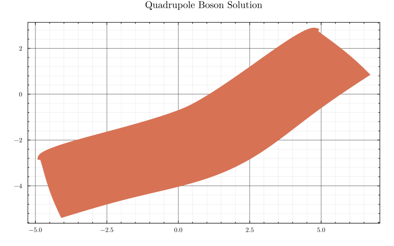
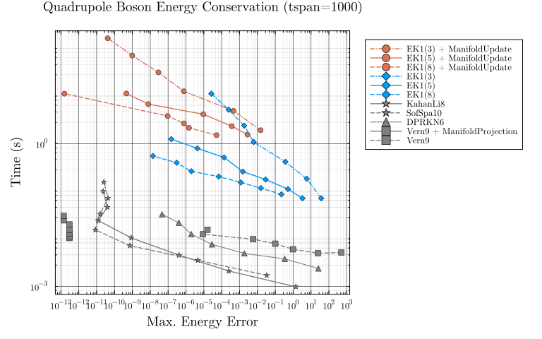
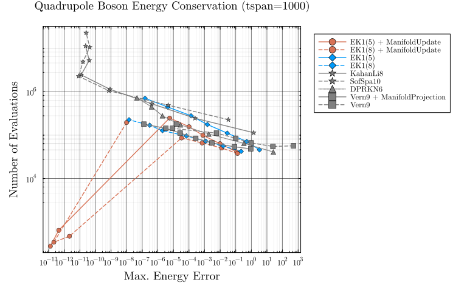

# Quadrupole Boson Energy Conservation


!!! note "Summary"
    The Quadrupole Boson Hamiltonian is a 2D Hamiltonian system with cubic and quartic
    potential terms. This benchmark compares the energy preservation of different solver
    approaches using a work-precision diagram.


```@raw html
<details><summary>Code:</summary>
```
```julia
using LinearAlgebra, Statistics
using SciMLBase, OrdinaryDiffEq, DiffEqCallbacks, Plots
using ProbNumDiffEq

Plots.theme(
    :dao;
    markerstrokewidth=0.5,
    legend=:outertopright,
    margin=5Plots.mm,
    xticks=10.0 .^ (-16:1:16),
)
```
```@raw html
</details>
```


```@raw html
<details><summary>Code:</summary>
```
```julia
const A_QB = 1.0
const B_QB = 0.55
const D_QB = 0.4

function QB_acceleration!(ddu, du, u, p, t)
    q1, q2 = u
    r2 = q1^2 + q2^2
    ddu[1] = -A_QB * q1 - 3 * B_QB / sqrt(2) * (q2^2 - q1^2) - D_QB * q1 * r2
    ddu[2] = -q2 * (A_QB + 3 * sqrt(2) * B_QB * q1 + D_QB * r2)
end
u0 = [4.919080920016389, 2.836942666663649]
du0 = [0.0, 0.0]
tspan = (0.0, 1000.0)
prob_2nd = SecondOrderODEProblem(QB_acceleration!, du0, u0, tspan)

function QB_dp!(dp, p, q, params, t)
    q1, q2 = q
    r2 = q1^2 + q2^2
    dp[1] = -A_QB * q1 - 3 * B_QB / sqrt(2) * (q2^2 - q1^2) - D_QB * q1 * r2
    dp[2] = -q2 * (A_QB + 3 * sqrt(2) * B_QB * q1 + D_QB * r2)
end
function QB_dq!(dq, p, q, params, t)
    dq[1] = A_QB * p[1]
    dq[2] = A_QB * p[2]
end
prob_dyn = DynamicalODEProblem(QB_dp!, QB_dq!, du0, u0, tspan)

function H_QB(dx, dy, x, y)
    r2 = x^2 + y^2
    A_QB / 2 * (dx^2 + dy^2) + A_QB / 2 * r2 +
        B_QB / sqrt(2) * x * (3 * y^2 - x^2) + D_QB / 4 * r2^2
end
H_QB(u) = H_QB(u...)
E0 = H_QB(du0..., u0...)

ref_sol = solve(prob_2nd, Vern9(), abstol=1/10^14, reltol=1/10^14)
plot(ref_sol, idxs=(3, 4), title="Quadrupole Boson Solution", legend=false,
     xticks=:auto, yticks=:auto)
```
```@raw html
</details>
```




## [Energy Error Work-Precision Diagram](@id qb_energy_wpd)

```@raw html
<details><summary>Code:</summary>
```
```julia
# `ManifoldUpdate` fires as a `DiscreteCallback`, which by default saves the state both
# before and after its `affect!`; since `savevalues!` at the "before" position always
# runs regardless of `save_positions` when `save_everystep=true`, both the raw and the
# manifold-corrected state end up in `sol.u` at the same `t`. Keep only the last (i.e.
# manifold-corrected) value per unique `t` so the error metric reflects the actual output.
function last_per_t(sol)
    n = length(sol.t)
    return (sol.u[i] for i in 1:n if i == n || sol.t[i] != sol.t[i+1])
end

function adaptive_energy_wpd(prob, alg, abstols, reltols, E0, Hfunc; numruns=5, kwargs...)
    errors = Float64[]
    times = Float64[]
    nevals = Int[]
    for (abstol, reltol) in zip(abstols, reltols)
        kw = (; abstol, reltol, dense=false, maxiters=Int(1e7), kwargs...)
        local sol
        try
            sol = solve(prob, alg; kw...)
        catch e
            @warn "solve failed, skipping" alg abstol reltol exception = e
            continue
        end
        sol.retcode == SciMLBase.ReturnCode.Success || continue
        push!(errors, maximum(abs(Hfunc(u) - E0) for u in last_per_t(sol)))
        push!(nevals, sol.stats.nf + sol.stats.nf2)
        solve(prob, alg; kw...)
        t = minimum(@elapsed(solve(prob, alg; kw...)) for _ in 1:numruns)
        push!(times, t)
    end
    errors, times, nevals
end

function fixedstep_energy_wpd(prob, alg, dts, E0, Hfunc; numruns=5, kwargs...)
    errors = Float64[]
    times = Float64[]
    nevals = Int[]
    for dt in dts
        kw = (; dt, adaptive=false, dense=false, maxiters=Int(1e7), kwargs...)
        local sol
        try
            sol = solve(prob, alg; kw...)
        catch e
            @warn "solve failed, skipping" alg dt exception = e
            continue
        end
        sol.retcode == SciMLBase.ReturnCode.Success || continue
        push!(errors, maximum(abs(Hfunc(u) - E0) for u in last_per_t(sol)))
        push!(nevals, sol.stats.nf + sol.stats.nf2)
        solve(prob, alg; kw...)
        t = minimum(@elapsed(solve(prob, alg; kw...)) for _ in 1:numruns)
        push!(times, t)
    end
    errors, times, nevals
end
```
```@raw html
</details>
```


```@raw html
<details><summary>Code:</summary>
```
```julia
abstols = 1.0 ./ 10.0 .^ (5:11)
reltols = 1.0 ./ 10.0 .^ (2:8)
dts = 10.0 .^ range(-0.5, -2.5, length=7)

residual(u) = [H_QB(u) - E0]
cb_mu = ManifoldUpdate(residual)

function energy_manifold!(resid, u, p)
    resid[1] = H_QB(u) - E0
end
function energy_jacobian!(J, u, p)
    dx, dy, x, y = u
    r2 = x^2 + y^2
    J[1, 1] = A_QB * dx
    J[1, 2] = A_QB * dy
    J[1, 3] = A_QB * x + B_QB / sqrt(2) * (3 * y^2 - 3 * x^2) + D_QB * x * r2
    J[1, 4] = A_QB * y + 6 * B_QB / sqrt(2) * x * y + D_QB * y * r2
end
cb_mp = ManifoldProjection(energy_manifold!;
    manifold_jacobian=energy_jacobian!,
    resid_prototype=zeros(1),
    autonomous=Val(true))
```
```@raw html
</details>
```


```@raw html
<details><summary>Code:</summary>
```
```julia
e_ek1_mu5, t_ek1_mu5, n_ek1_mu5 = adaptive_energy_wpd(
    prob_2nd, EK1(order=5, smooth=false), abstols, reltols, E0, H_QB; callback=cb_mu)
e_ek1_mu8, t_ek1_mu8, n_ek1_mu8 = adaptive_energy_wpd(
    prob_2nd, EK1(order=8, smooth=false), abstols, reltols, E0, H_QB; callback=cb_mu)

e_ek1_5, t_ek1_5, n_ek1_5 = adaptive_energy_wpd(
    prob_2nd, EK1(order=5, smooth=false), abstols, reltols, E0, H_QB)
e_ek1_8, t_ek1_8, n_ek1_8 = adaptive_energy_wpd(
    prob_2nd, EK1(order=8, smooth=false), abstols, reltols, E0, H_QB)

e_kl8, t_kl8, n_kl8 = fixedstep_energy_wpd(prob_dyn, KahanLi8(), dts, E0, H_QB)
e_ss10, t_ss10, n_ss10 = fixedstep_energy_wpd(prob_dyn, SofSpa10(), dts, E0, H_QB)

e_dprkn6, t_dprkn6, n_dprkn6 = adaptive_energy_wpd(prob_2nd, DPRKN6(), abstols, reltols, E0, H_QB)

e_vern9_mp, t_vern9_mp, n_vern9_mp = adaptive_energy_wpd(
    prob_2nd, Vern9(), abstols, reltols, E0, H_QB; callback=cb_mp)
e_vern9, t_vern9, n_vern9 = adaptive_energy_wpd(prob_2nd, Vern9(), abstols, reltols, E0, H_QB)
```
```@raw html
</details>
```


```@raw html
<details><summary>Code:</summary>
```
```julia
plot(xlabel="Max. Energy Error", ylabel="Time (s)",
     xscale=:log10, yscale=:log10,
     title="Quadrupole Boson Energy Conservation (tspan=1000)")

plot!(e_ek1_mu5, t_ek1_mu5, label="EK1(5) + ManifoldUpdate", color=1, marker=:circle)
plot!(e_ek1_mu8, t_ek1_mu8, label="EK1(8) + ManifoldUpdate", color=1, marker=:circle,
      linestyle=:dash)
plot!(e_ek1_5, t_ek1_5, label="EK1(5)", color=2, marker=:diamond)
plot!(e_ek1_8, t_ek1_8, label="EK1(8)", color=2, marker=:diamond, linestyle=:dash)
plot!(e_kl8, t_kl8, label="KahanLi8", color=:gray, marker=:star5)
plot!(e_ss10, t_ss10, label="SofSpa10", color=:gray, marker=:star5, linestyle=:dash)
plot!(e_dprkn6, t_dprkn6, label="DPRKN6", color=:gray, marker=:utriangle, linestyle=:dot)
plot!(e_vern9_mp, t_vern9_mp, label="Vern9 + ManifoldProjection", color=:gray,
      marker=:square)
plot!(e_vern9, t_vern9, label="Vern9", color=:gray, marker=:square, linestyle=:dash)
```
```@raw html
</details>
```



```@raw html
<details><summary>Code:</summary>
```
```julia
plot(xlabel="Max. Energy Error", ylabel="Number of Evaluations",
     xscale=:log10, yscale=:log10,
     title="Quadrupole Boson Energy Conservation (tspan=1000)")

plot!(e_ek1_mu5, n_ek1_mu5, label="EK1(5) + ManifoldUpdate", color=1, marker=:circle)
plot!(e_ek1_mu8, n_ek1_mu8, label="EK1(8) + ManifoldUpdate", color=1, marker=:circle,
      linestyle=:dash)
plot!(e_ek1_5, n_ek1_5, label="EK1(5)", color=2, marker=:diamond)
plot!(e_ek1_8, n_ek1_8, label="EK1(8)", color=2, marker=:diamond, linestyle=:dash)
plot!(e_kl8, n_kl8, label="KahanLi8", color=:gray, marker=:star5)
plot!(e_ss10, n_ss10, label="SofSpa10", color=:gray, marker=:star5, linestyle=:dash)
plot!(e_dprkn6, n_dprkn6, label="DPRKN6", color=:gray, marker=:utriangle, linestyle=:dot)
plot!(e_vern9_mp, n_vern9_mp, label="Vern9 + ManifoldProjection", color=:gray,
      marker=:square)
plot!(e_vern9, n_vern9, label="Vern9", color=:gray, marker=:square, linestyle=:dash)
```
```@raw html
</details>
```




## Appendix

```@raw html
<details><summary>Computer information:</summary>
```

```julia
using InteractiveUtils
InteractiveUtils.versioninfo()
```

```
Julia Version 1.13.0
Commit d1c37793dd2 (2026-09-09 19:00 UTC)
Build Info:
  Official https://julialang.org release
Platform Info:
  OS: Linux (x86_64-linux-gnu)
  CPU: 128 × AMD Ryzen Threadripper PRO 7985WX 64-Cores
  WORD_SIZE: 64
  LLVM: libLLVM-20.1.8 (ORCJIT, znver4)
  GC: Built with stock GC
Threads: 16 default, 1 interactive, 16 GC (on 128 virtual cores)
Environment:
  LD_LIBRARY_PATH = 
  JULIA_PROJECT = benchmarks
```

```@raw html
</details>
```

```@raw html
<details><summary>Package information:</summary>
```

```julia
using Pkg
Pkg.status()
```

```
Status `/home/nrbosch/.julia/dev/ProbNumDiffEq2/benchmarks/Project.toml`
⌃ [459566f4] DiffEqCallbacks v4.19.2
⌅ [f3b72e0c] DiffEqDevTools v2.53.0
  [31c24e10] Distributions v0.25.131
  [7073ff75] IJulia v1.34.4
  [7f56f5a3] LSODA v1.2.0
  [e6f89c97] LoggingExtras v1.2.0
⌃ [e2752cbe] MATLABDiffEq v1.6.0
⌃ [961ee093] ModelingToolkit v11.26.8
  [54ca160b] ODEInterface v0.5.2
⌃ [09606e27] ODEInterfaceDiffEq v4.1.0
⌃ [1dea7af3] OrdinaryDiffEq v6.111.0
⌃ [65888b18] ParameterizedFunctions v5.25.0
  [91a5bcdd] Plots v1.41.7
  [bf3e78b0] ProbNumDiffEq v0.18.0 `..`
⌅ [0bca4576] SciMLBase v2.155.2
⌃ [505e40e9] SciPyDiffEq v0.2.9
  [ce78b400] SimpleUnPack v1.1.0
  [90137ffa] StaticArrays v1.9.20
⌃ [c3572dad] Sundials v6.3.0
  [44d3d7a6] Weave v0.10.12
⌃ [0518478a] deSolveDiffEq v1.4.1
Info Packages marked with ⌃ and ⌅ have new versions available. Those with ⌃ may be upgradable, but those with ⌅ are restricted by compatibility constraints from upgrading. To see why use `status --outdated`
```

```@raw html
</details>
```

```@raw html
<details><summary>Full manifest:</summary>
```

```julia
Pkg.status(mode=Pkg.PKGMODE_MANIFEST)
```

```
Status `/home/nrbosch/.julia/dev/ProbNumDiffEq2/benchmarks/Manifest.toml`
  [47edcb42] ADTypes v1.24.0
  [14f7f29c] AMD v0.5.4
  [621f4979] AbstractFFTs v1.5.0
  [6e696c72] AbstractPlutoDingetjes v1.4.1
  [1520ce14] AbstractTrees v0.4.5
  [7d9f7c33] Accessors v0.1.45
⌃ [79e6a3ab] Adapt v4.7.0
  [66dad0bd] AliasTables v1.1.3
  [ec485272] ArnoldiMethod v0.4.0
  [c9d4266f] ArrayAllocators v0.3.0
  [4fba245c] ArrayInterface v7.30.2
  [4c555306] ArrayLayouts v1.12.2
  [15f4f7f2] AutoHashEquals v2.2.0
  [aae01518] BandedMatrices v1.12.0
  [0e736298] Bessels v0.2.8
  [e2ed5e7c] Bijections v0.2.2
  [caf10ac8] BipartiteGraphs v0.1.14
  [62783981] BitTwiddlingConvenienceFunctions v0.1.6
  [8e7c35d0] BlockArrays v1.10.0
⌃ [70df07ce] BracketingNonlinearSolve v1.12.1
  [fa961155] CEnum v0.5.0
  [2a0fbf3d] CPUSummary v0.2.7
  [0b6fb165] ChunkCodecCore v1.0.2
  [4c0bbee4] ChunkCodecLibZlib v1.1.0
  [55437552] ChunkCodecLibZstd v1.0.0
  [fb6a15b2] CloseOpenIntervals v0.1.13
  [08986516] Collects v1.1.0
  [35d6a980] ColorSchemes v3.31.0
  [3da002f7] ColorTypes v0.12.1
  [c3611d14] ColorVectorSpace v0.11.0
  [5ae59095] Colors v0.13.1
⌅ [861a8166] Combinatorics v1.0.2
  [38540f10] CommonSolve v0.2.14
  [bbf7d656] CommonSubexpressions v0.3.1
  [f70d9fcc] CommonWorldInvalidations v1.2.2
  [34da2185] Compat v4.18.1
  [b152e2b5] CompositeTypes v0.1.4
  [a33af91c] CompositionsBase v0.1.2
  [2569d6c7] ConcreteStructs v0.2.8
  [8f4d0f93] Conda v1.10.3
  [187b0558] ConstructionBase v1.6.0
  [d38c429a] Contour v0.6.3
  [adafc99b] CpuId v0.3.1
  [717857b8] DSP v0.8.6
  [9a962f9c] DataAPI v1.16.0
  [864edb3b] DataStructures v0.19.6
  [e2d170a0] DataValueInterfaces v1.0.0
  [8bb1440f] DelimitedFiles v1.9.1
⌅ [2b5f629d] DiffEqBase v6.218.0
⌃ [459566f4] DiffEqCallbacks v4.19.2
⌅ [f3b72e0c] DiffEqDevTools v2.53.0
⌃ [77a26b50] DiffEqNoiseProcess v5.32.0
  [163ba53b] DiffResults v1.1.0
  [b552c78f] DiffRules v1.16.0
  [a0c0ee7d] DifferentiationInterface v0.7.21
  [b4f34e82] Distances v0.10.12
  [31c24e10] Distributions v0.25.131
  [ffbed154] DocStringExtensions v0.9.5
  [5b8099bc] DomainSets v0.8.1
  [7c1d4256] DynamicPolynomials v0.6.8
  [4e289a0a] EnumX v1.0.7
  [f151be2c] EnzymeCore v0.8.21
  [6912e4f1] Espresso v0.6.4
⌃ [d4d017d3] ExponentialUtilities v1.31.0
  [e2ba6199] ExprTools v0.1.11
  [55351af7] ExproniconLite v0.10.14
  [c87230d0] FFMPEG v0.4.5
  [7a1cc6ca] FFTW v1.10.0
  [7034ab61] FastBroadcast v1.4.0
  [9aa1b823] FastClosures v0.3.2
  [442a2c76] FastGaussQuadrature v1.3.0
  [a4df4552] FastPower v1.5.0
  [5789e2e9] FileIO v1.20.0
  [1a297f60] FillArrays v1.17.0
  [64ca27bc] FindFirstFunctions v3.2.1
  [6a86dc24] FiniteDiff v2.33.0
  [b59a298d] FiniteHorizonGramians v0.2.1
⌅ [53c48c17] FixedPointNumbers v0.8.6
  [3821ddf9] FixedSizeArrays v1.3.0
  [1fa38f19] Format v1.3.7
  [f6369f11] ForwardDiff v1.4.6
  [a85aefff] FunctionMaps v0.1.2
  [069b7b12] FunctionWrappers v1.1.3
  [77dc65aa] FunctionWrappersWrappers v1.13.0
  [46192b85] GPUArraysCore v0.2.0
  [28b8d3ca] GR v0.73.27
  [a0844989] Gamma v1.2.0
  [c145ed77] GenericSchur v0.5.8
  [86223c79] Graphs v1.15.0
  [076d061b] HashArrayMappedTries v0.2.0
⌅ [eafb193a] Highlights v0.5.3
  [3e5b6fbb] HostCPUFeatures v0.1.18
  [34004b35] HypergeometricFunctions v0.3.30
  [7073ff75] IJulia v1.34.4
  [615f187c] IfElse v0.1.1
⌃ [3263718b] ImplicitDiscreteSolve v1.11.0
  [d25df0c9] Inflate v0.1.5
  [18e54dd8] IntegerMathUtils v0.1.4
  [8197267c] IntervalSets v0.7.14
  [3587e190] InverseFunctions v0.1.17
  [92d709cd] IrrationalConstants v0.2.6
  [c8e1da08] IterTools v1.10.0
  [82899510] IteratorInterfaceExtensions v1.0.0
  [033835bb] JLD2 v0.6.6
  [1019f520] JLFzf v0.1.11
  [692b3bcd] JLLWrappers v1.8.0
⌅ [682c06a0] JSON v0.21.4
  [ae98c720] Jieko v0.2.1
⌃ [ccbc3e58] JumpProcesses v9.29.0
  [2c470bb0] Kronecker v0.5.5
  [ba0b0d4f] Krylov v0.10.10
  [7f56f5a3] LSODA v1.2.0
  [b964fa9f] LaTeXStrings v1.4.1
  [23fbe1c1] Latexify v0.16.12
  [10f19ff3] LayoutPointers v0.1.17
⌃ [87fe0de2] LineSearch v0.1.14
⌃ [d3d80556] LineSearches v7.5.1
  [7a12625a] LinearMaps v3.11.4
⌅ [7ed4a6bd] LinearSolve v3.87.0
  [2ab3a3ac] LogExpFunctions v1.0.1
  [e6f89c97] LoggingExtras v1.2.0
  [bdcacae8] LoopVectorization v0.12.174
  [10e44e05] MATLAB v0.10.0
⌃ [e2752cbe] MATLABDiffEq v1.6.0
  [1914dd2f] MacroTools v0.5.16
  [d125e4d3] ManualMemory v0.1.8
  [99c1a7ee] MatrixEquations v2.6.6
  [a3b82374] MatrixFactorizations v3.1.3
  [bb5d69b7] MaybeInplace v0.1.8
  [442fdcdd] Measures v0.3.3
  [e1d29d7a] Missings v1.2.0
⌃ [961ee093] ModelingToolkit v11.26.8
⌃ [7771a370] ModelingToolkitBase v1.42.2
⌃ [6bb917b9] ModelingToolkitTearing v1.15.0
  [2e0e35c7] Moshi v0.3.12
  [46d2c3a1] MuladdMacro v0.2.7
  [102ac46a] MultivariatePolynomials v0.5.19
  [ffc61752] Mustache v1.0.21
  [d8a4904e] MutableArithmetics v1.8.0
⌅ [d41bc354] NLSolversBase v7.10.0
⌅ [2774e3e8] NLsolve v4.5.1
  [77ba4419] NaNMath v1.1.4
  [356022a1] NamedDims v1.2.3
⌃ [8913a72c] NonlinearSolve v4.19.1
⌅ [be0214bd] NonlinearSolveBase v2.30.3
⌃ [5959db7a] NonlinearSolveFirstOrder v2.1.1
⌃ [9a2c21bd] NonlinearSolveQuasiNewton v1.13.1
⌃ [26075421] NonlinearSolveSpectralMethods v1.7.1
  [54ca160b] ODEInterface v0.5.2
⌃ [09606e27] ODEInterfaceDiffEq v4.1.0
  [6fd5a793] Octavian v0.3.29
  [6fe1bfb0] OffsetArrays v1.17.0
⌅ [bac558e1] OrderedCollections v1.8.2
⌃ [1dea7af3] OrdinaryDiffEq v6.111.0
⌅ [89bda076] OrdinaryDiffEqAdamsBashforthMoulton v1.11.0
⌅ [6ad6398a] OrdinaryDiffEqBDF v1.26.0
⌅ [bbf590c4] OrdinaryDiffEqCore v3.33.1
⌅ [50262376] OrdinaryDiffEqDefault v1.14.0
⌅ [4302a76b] OrdinaryDiffEqDifferentiation v2.9.0
⌅ [9286f039] OrdinaryDiffEqExplicitRK v1.12.0
⌅ [e0540318] OrdinaryDiffEqExponentialRK v1.15.0
⌅ [becaefa8] OrdinaryDiffEqExtrapolation v1.18.0
⌅ [5960d6e9] OrdinaryDiffEqFIRK v1.26.0
⌅ [101fe9f7] OrdinaryDiffEqFeagin v1.10.0
⌅ [d3585ca7] OrdinaryDiffEqFunctionMap v1.11.0
⌅ [d28bc4f8] OrdinaryDiffEqHighOrderRK v1.12.0
⌅ [9f002381] OrdinaryDiffEqIMEXMultistep v1.14.0
⌅ [521117fe] OrdinaryDiffEqLinear v1.12.0
⌅ [1344f307] OrdinaryDiffEqLowOrderRK v1.13.0
⌅ [b0944070] OrdinaryDiffEqLowStorageRK v1.15.0
⌅ [127b3ac7] OrdinaryDiffEqNonlinearSolve v1.28.0
⌅ [c9986a66] OrdinaryDiffEqNordsieck v1.11.0
⌅ [5dd0a6cf] OrdinaryDiffEqPDIRK v1.14.0
⌅ [5b33eab2] OrdinaryDiffEqPRK v1.10.0
⌅ [04162be5] OrdinaryDiffEqQPRK v1.10.0
⌅ [af6ede74] OrdinaryDiffEqRKN v1.12.0
⌅ [43230ef6] OrdinaryDiffEqRosenbrock v1.31.1
⌅ [2d112036] OrdinaryDiffEqSDIRK v1.14.0
⌅ [669c94d9] OrdinaryDiffEqSSPRK v1.14.0
⌅ [e3e12d00] OrdinaryDiffEqStabilizedIRK v1.14.0
⌅ [358294b1] OrdinaryDiffEqStabilizedRK v1.11.1
⌅ [fa646aed] OrdinaryDiffEqSymplecticRK v1.13.0
⌅ [b1df2697] OrdinaryDiffEqTsit5 v1.12.0
⌅ [79d7bb75] OrdinaryDiffEqVerner v1.14.0
  [90014a1f] PDMats v0.11.41
  [fe68d972] PSDMatrices v0.5.0
⌃ [65888b18] ParameterizedFunctions v5.25.0
⌅ [d96e819e] Parameters v0.12.3
⌅ [69de0a69] Parsers v2.8.8
  [ccf2f8ad] PlotThemes v3.3.0
  [995b91a9] PlotUtils v1.4.4
  [91a5bcdd] Plots v1.41.7
  [e409e4f3] PoissonRandom v0.4.13
  [f517fe37] Polyester v0.7.19
  [1d0040c9] PolyesterWeave v0.2.2
  [f27b6e38] Polynomials v4.1.3
  [d236fae5] PreallocationTools v1.7.1
  [aea7be01] PrecompileTools v1.3.4
  [21216c6a] Preferences v1.6.0
  [27ebfcd6] Primes v0.5.7
  [bf3e78b0] ProbNumDiffEq v0.18.0 `..`
  [43287f4e] PtrArrays v1.4.0
  [0c0d3e7f] PureKLU v1.5.0
  [438e738f] PyCall v1.96.4
  [1fd47b50] QuadGK v2.11.3
  [988b38a3] ReadOnlyArrays v0.2.0
  [795d4caa] ReadOnlyDicts v1.0.1
  [3cdcf5f2] RecipesBase v1.3.4
  [01d81517] RecipesPipeline v0.6.12
⌅ [731186ca] RecursiveArrayTools v3.54.0
  [189a3867] Reexport v1.2.2
  [05181044] RelocatableFolders v1.0.1
  [ae029012] Requires v1.3.1
  [ae5879a3] ResettableStacks v1.4.0
  [79098fc4] Rmath v0.9.0
  [47965b36] RootedTrees v2.27.0
  [f2b01f46] Roots v3.0.8
  [7e49a35a] RuntimeGeneratedFunctions v0.5.26
⌃ [9dfe8606] SCCNonlinearSolve v1.13.0
  [94e857df] SIMDTypes v0.1.0
  [476501e8] SLEEFPirates v0.6.46
⌅ [0bca4576] SciMLBase v2.155.2
⌃ [19f34311] SciMLJacobianOperators v0.1.17
⌅ [a6db7da4] SciMLLogging v1.10.1
  [c0aeaf25] SciMLOperators v1.30.1
  [431bcebd] SciMLPublic v1.3.0
  [53ae85a6] SciMLStructures v1.10.5
⌃ [505e40e9] SciPyDiffEq v0.2.9
  [7e506255] ScopedValues v1.6.2
  [6c6a2e73] Scratch v1.3.0
  [efcf1570] Setfield v1.1.2
  [992d4aef] Showoff v1.1.1
⌃ [727e6d20] SimpleNonlinearSolve v2.12.0
  [699a6c99] SimpleTraits v0.9.6
  [ce78b400] SimpleUnPack v1.1.0
  [a2af1166] SortingAlgorithms v1.2.3
  [a57abbd0] SparseColumnPivotedQR v2.1.8
  [0a514795] SparseMatrixColorings v0.4.28
  [276daf66] SpecialFunctions v2.9.0
  [860ef19b] StableRNGs v1.0.4
  [0c0c59c1] StarAlgebras v0.3.0
  [64909d44] StateSelection v1.11.1
  [aedffcd0] Static v1.4.6
  [0d7ed370] StaticArrayInterface v1.10.0
  [90137ffa] StaticArrays v1.9.20
  [1e83bf80] StaticArraysCore v1.4.4
  [10745b16] Statistics v1.11.5
  [82ae8749] StatsAPI v1.8.0
  [2913bbd2] StatsBase v0.34.13
  [4c63d2b9] StatsFuns v2.2.1
  [7792a7ef] StrideArraysCore v0.5.9
  [69024149] StringEncodings v0.3.7
  [09ab397b] StructArrays v0.7.3
⌃ [c3572dad] Sundials v6.3.0
  [2efcf032] SymbolicIndexingInterface v0.3.55
  [19f23fe9] SymbolicLimits v1.2.1
⌅ [d1185830] SymbolicUtils v4.45.0
⌃ [0c5d862f] Symbolics v7.39.0
  [3783bdb8] TableTraits v1.0.1
  [bd369af6] Tables v1.14.0
  [ed4db957] TaskLocalValues v0.1.3
⌃ [92b13dbe] TaylorIntegration v0.18.14
  [6aa5eb33] TaylorSeries v0.22.6
  [62fd8b95] TensorCore v0.1.1
  [8ea1fca8] TermInterface v2.0.0
  [8290d209] ThreadingUtilities v0.5.6
⌅ [a759f4b9] TimerOutputs v0.5.29
  [c751599d] ToeplitzMatrices v0.8.5
  [781d530d] TruncatedStacktraces v1.4.0
  [3a884ed6] UnPack v1.0.2
  [1cfade01] UnicodeFun v0.4.1
  [41fe7b60] Unzip v0.2.0
  [3d5dd08c] VectorizationBase v0.21.74
  [81def892] VersionParsing v1.3.0
  [d30d5f5c] WeakCacheSets v0.1.0
  [44d3d7a6] Weave v0.10.12
  [ddb6d928] YAML v0.4.16
  [c2297ded] ZMQ v1.5.1
⌃ [0518478a] deSolveDiffEq v1.4.1
  [6e34b625] Bzip2_jll v1.0.9+0
  [83423d85] Cairo_jll v1.18.7+0
  [ee1fde0b] Dbus_jll v1.16.2+0
  [2702e6a9] EpollShim_jll v0.0.20230411+1
  [2e619515] Expat_jll v2.8.4+0
⌅ [b22a6f82] FFMPEG_jll v8.1.2+0
  [f5851436] FFTW_jll v3.3.12+0
  [a3f928ae] Fontconfig_jll v2.17.1+0
  [d7e528f0] FreeType2_jll v2.14.3+1
  [559328eb] FriBidi_jll v1.0.17+0
  [0656b61e] GLFW_jll v3.5.1+0
  [d2c73de3] GR_jll v0.73.27+0
⌅ [b0724c58] GettextRuntime_jll v0.22.4+0
  [61579ee1] Ghostscript_jll v9.55.1+0
  [7746bdde] Glib_jll v2.88.3+0
  [3b182d85] Graphite2_jll v1.3.16+0
  [2e76f6c2] HarfBuzz_jll v100.14004.0+0
  [1d5cc7b8] IntelOpenMP_jll v2025.2.0+0
  [aacddb02] JpegTurbo_jll v3.2.0+1
  [c1c5ebd0] LAME_jll v3.100.3+0
  [88015f11] LERC_jll v4.2.0+0
  [1d63c593] LLVMOpenMP_jll v23.1.1+0
  [aae0fff6] LSODA_jll v0.1.2+0
⌅ [e9f186c6] Libffi_jll v3.4.7+0
  [7e76a0d4] Libglvnd_jll v1.7.1+1
  [94ce4f54] Libiconv_jll v1.18.0+0
  [4b2f31a3] Libmount_jll v2.42.0+0
  [89763e89] Libtiff_jll v4.7.3+0
  [38a345b3] Libuuid_jll v2.42.0+0
  [856f044c] MKL_jll v2025.2.0+0
  [c771fb93] ODEInterface_jll v0.0.2+0
  [e7412a2a] Ogg_jll v1.3.6+0
  [656ef2d0] OpenBLAS32_jll v0.3.34+0
  [efe28fd5] OpenSpecFun_jll v0.5.6+0
  [91d4177d] Opus_jll v1.6.1+0
  [36c8627f] Pango_jll v1.58.2+0
  [30392449] Pixman_jll v0.46.4+0
  [c0090381] Qt6Base_jll v6.10.2+2
  [629bc702] Qt6Declarative_jll v6.10.2+2
  [ce943373] Qt6ShaderTools_jll v6.10.2+1
  [6de9746b] Qt6Svg_jll v6.10.2+0
  [e99dba38] Qt6Wayland_jll v6.10.2+1
  [f50d1b31] Rmath_jll v0.5.2+0
  [ca45d3f4] SuiteSparse32_jll v7.12.1+1
  [fb77eaff] Sundials_jll v7.5.0+0
  [a44049a8] Vulkan_Loader_jll v1.3.243+0
  [a2964d1f] Wayland_jll v1.24.0+0
  [ffd25f8a] XZ_jll v5.8.4+0
  [f67eecfb] Xorg_libICE_jll v1.1.2+0
  [c834827a] Xorg_libSM_jll v1.2.6+0
  [4f6342f7] Xorg_libX11_jll v1.8.13+0
  [0c0b7dd1] Xorg_libXau_jll v1.0.13+0
  [935fb764] Xorg_libXcursor_jll v1.2.4+0
  [a3789734] Xorg_libXdmcp_jll v1.1.6+0
  [1082639a] Xorg_libXext_jll v1.3.8+0
  [d091e8ba] Xorg_libXfixes_jll v6.0.2+0
  [a51aa0fd] Xorg_libXi_jll v1.8.4+0
  [d1454406] Xorg_libXinerama_jll v1.1.7+0
  [ec84b674] Xorg_libXrandr_jll v1.5.6+0
  [ea2f1a96] Xorg_libXrender_jll v0.9.12+0
  [a65dc6b1] Xorg_libpciaccess_jll v0.19.0+0
  [c7cfdc94] Xorg_libxcb_jll v1.17.1+0
  [cc61e674] Xorg_libxkbfile_jll v1.2.0+0
  [e920d4aa] Xorg_xcb_util_cursor_jll v0.1.6+0
  [12413925] Xorg_xcb_util_image_jll v0.4.1+0
  [2def613f] Xorg_xcb_util_jll v0.4.1+0
  [975044d2] Xorg_xcb_util_keysyms_jll v0.4.1+0
  [0d47668e] Xorg_xcb_util_renderutil_jll v0.3.10+0
  [c22f9ab0] Xorg_xcb_util_wm_jll v0.4.2+0
  [35661453] Xorg_xkbcomp_jll v1.4.7+0
  [33bec58e] Xorg_xkeyboard_config_jll v2.47.0+2
  [c5fb5394] Xorg_xtrans_jll v1.6.0+0
  [8f1865be] ZeroMQ_jll v4.3.6+0
  [35ca27e7] eudev_jll v3.2.14+0
⌅ [214eeab7] fzf_jll v0.61.1+0
  [a4ae2306] libaom_jll v3.14.1+0
  [0ac62f75] libass_jll v0.17.5+0
  [1183f4f0] libdecor_jll v0.2.2+0
  [8e53e030] libdrm_jll v2.4.134+0
  [2db6ffa8] libevdev_jll v1.13.4+0
  [f638f0a6] libfdk_aac_jll v2.0.4+0
  [36db933b] libinput_jll v1.28.1+0
  [b53b4c65] libpng_jll v1.6.58+0
  [a9144af2] libsodium_jll v1.0.21+0
  [9a156e7d] libva_jll v2.23.0+0
  [f27f6e37] libvorbis_jll v1.3.8+0
  [009596ad] mtdev_jll v1.1.7+0
  [1317d2d5] oneTBB_jll v2022.3.0+0
⌅ [1270edf5] x264_jll v10164.0.1+0
  [dfaa095f] x265_jll v4.1.0+0
  [d8fb68d0] xkbcommon_jll v1.13.0+0
  [0dad84c5] ArgTools v1.1.2
  [56f22d72] Artifacts v1.11.0
  [2a0f44e3] Base64 v1.11.0
  [ade2ca70] Dates v1.11.0
  [8ba89e20] Distributed v1.11.0
  [f43a241f] Downloads v1.7.0
  [7b1f6079] FileWatching v1.11.0
  [9fa8497b] Future v1.11.0
  [b77e0a4c] InteractiveUtils v1.11.0
  [ac6e5ff7] JuliaSyntaxHighlighting v1.12.0
  [4af54fe1] LazyArtifacts v1.11.0
  [b27032c2] LibCURL v1.0.0
  [76f85450] LibGit2 v1.11.0
  [8f399da3] Libdl v1.11.0
  [37e2e46d] LinearAlgebra v1.13.0
  [56ddb016] Logging v1.11.0
  [d6f4376e] Markdown v1.11.0
  [a63ad114] Mmap v1.11.0
  [ca575930] NetworkOptions v1.3.0
  [44cfe95a] Pkg v1.13.0
  [de0858da] Printf v1.11.0
  [3fa0cd96] REPL v1.11.0
  [9a3f8284] Random v1.11.0
  [ea8e919c] SHA v1.0.0
  [9e88b42a] Serialization v1.11.0
  [6462fe0b] Sockets v1.11.0
  [2f01184e] SparseArrays v1.13.0
  [f489334b] StyledStrings v1.11.0
  [4607b0f0] SuiteSparse
  [fa267f1f] TOML v1.0.3
  [a4e569a6] Tar v1.10.0
  [8dfed614] Test v1.11.0
  [cf7118a7] UUIDs v1.11.0
  [4ec0a83e] Unicode v1.11.0
  [e66e0078] CompilerSupportLibraries_jll v1.5.5+2
  [deac9b47] LibCURL_jll v8.18.0+1
  [e37daf67] LibGit2_jll v1.9.1+0
  [29816b5a] LibSSH2_jll v1.11.103+0
  [14a3606d] MozillaCACerts_jll v2026.8.13
  [4536629a] OpenBLAS_jll v0.3.30+0
  [05823500] OpenLibm_jll v0.8.7+0
  [458c3c95] OpenSSL_jll v3.5.6+0
  [efcefdf7] PCRE2_jll v10.46.0+0
  [bea87d4a] SuiteSparse_jll v7.10.1+0
  [83775a58] Zlib_jll v1.3.1+2
  [3161d3a3] Zstd_jll v1.5.7+1
  [8e850b90] libblastrampoline_jll v5.15.0+0
  [8e850ede] nghttp2_jll v1.67.1+0
  [3f19e933] p7zip_jll v17.8.2+0
Info Packages marked with ⌃ and ⌅ have new versions available. Those with ⌃ may be upgradable, but those with ⌅ are restricted by compatibility constraints from upgrading. To see why use `status --outdated -m`
```

```@raw html
</details>
```

