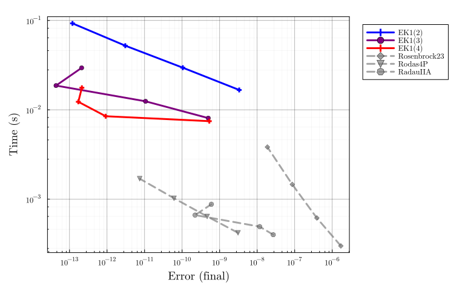

# ROBER benchmark

Adapted from
[SciMLBenchmarks.jl](https://docs.sciml.ai/SciMLBenchmarksOutput/stable/DAE/ROBERDAE/).

```julia
using LinearAlgebra, Statistics, InteractiveUtils
using DiffEqDevTools, ParameterizedFunctions, SciMLBase, OrdinaryDiffEq, Sundials, Plots
using ModelingToolkit
using ProbNumDiffEq

# Plotting theme
theme(:dao;
    markerstrokewidth=0.5,
    legend=:outertopright,
    bottom_margin=5Plots.mm,
    size = (1000, 400),
)
```


### ROBER problem definition

```julia
@variables t y₁(t)=1.0 y₂(t)=0.0 y₃(t)=0.0
@parameters k₁=0.04 k₂=3e7 k₃=1e4
D = Differential(t)
eqs = [
  D(y₁) ~ -k₁*y₁ + k₃*y₂*y₃
  D(y₂) ~  k₁*y₁ - k₃*y₂*y₃ - k₂*y₂^2
  0 ~  y₁ + y₂ + y₃ - 1
]
@named sys = ODESystem(eqs)
mmprob = ODEProblem(sys,[],(0.0,1e5))
daeprob = DAEProblem(sys,[D(y₁)=>-0.04, D(y₂)=>0.04, D(y₃)=>0.0],[],(0.0,1e5)) # can't handle this yet
odaeprob = ODAEProblem(structural_simplify(sys),[],(0.0,1e5)) # can't handle this yet

ref_sol = solve(daeprob,IDA(),abstol=1/10^14,reltol=1/10^14,dense=false)
plot(ref_sol, vars=[y₁,y₂,y₃], title="ROBER Solution", legend=false, ylims=(0, 1))
```


## EK1 accross orders

```julia
DENSE = false;
SAVE_EVERYSTEP = false;

_setups = [
  "EK1($order)" => Dict(:alg => EK1(order=order, smooth=DENSE))
  for order in 2:6
]

labels = first.(_setups)
setups = last.(_setups)

# works:
# abstols = 1.0 ./ 10.0 .^ (4:10)
# reltols = 1.0 ./ 10.0 .^ (1:7)
# test:
abstols = 1.0 ./ 10.0 .^ (4:9)
reltols = 1.0 ./ 10.0 .^ (1:6)

wp = WorkPrecisionSet(
    mmprob, abstols, reltols, setups;
    names = labels,
    #print_names = true,
    appxsol = ref_sol,
    dense = DENSE,
    save_everystep = SAVE_EVERYSTEP,
    numruns = 10,
    maxiters = Int(1e7),
    timeseries_errors = false,
    verbose = false,
)

plot(wp, palette=Plots.palette([:blue, :red], length(_setups)), xticks = 10.0 .^ (-16:1:5),
     xlims = (2e-15, 3e-7), ylims = (1e-2, 6e-1))
```




## Conclusion

- The `EK1` can solve mass-matrix DAEs! But it only really works well for low errors.
- Order 3 seems to work well here. But the order-to-error-tolerance heuristic should in principle still hold: lower tolerance level ``\rightarrow`` higher order.

## Appendix

Computer information:

```julia
InteractiveUtils.versioninfo()
```

```
Julia Version 1.8.5
Commit 17cfb8e65ea (2023-01-08 06:45 UTC)
Platform Info:
  OS: Linux (x86_64-linux-gnu)
  CPU: 12 × Intel(R) Core(TM) i7-6800K CPU @ 3.40GHz
  WORD_SIZE: 64
  LIBM: libopenlibm
  LLVM: libLLVM-13.0.1 (ORCJIT, broadwell)
  Threads: 12 on 12 virtual cores
Environment:
  JULIA_NUM_THREADS = auto
  JULIA_STACKTRACE_MINIMAL = true
```


