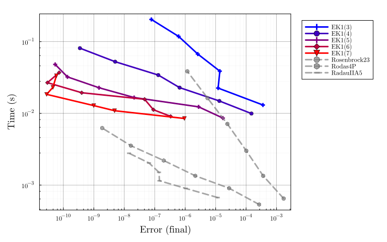
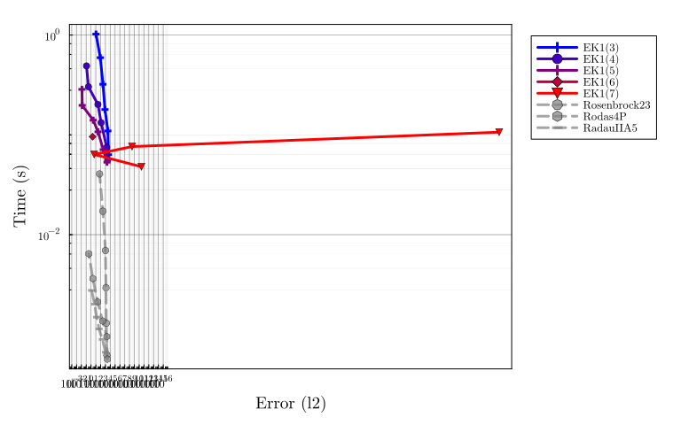
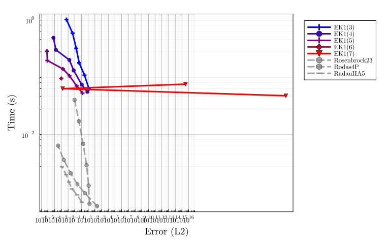

# Van der Pol benchmark


```julia
using LinearAlgebra, Statistics, InteractiveUtils
using DiffEqDevTools, ParameterizedFunctions, SciMLBase, OrdinaryDiffEq, Plots
using ProbNumDiffEq

# Plotting theme
theme(:dao;
    markerstrokewidth=0.5,
    legend=:outertopright,
    bottom_margin=5Plots.mm,
    size = (1000, 400),
)
```


### Van der Pol problem definition

```julia
function vanderpol!(du, u, p, t)
    du[1] = u[2]
    du[2] = p[1] * ((1 - u[1]^2) * u[2] - u[1])
end
p = [1e5]
tspan = (0.0, 6.3)
u0 = [2.0, 0.0]
prob = ODEProblem(vanderpol!, u0, tspan, p)

test_sol = solve(prob, RadauIIA5(), abstol=1/10^14, reltol=1/10^14, dense=false)
plot(test_sol, title="Van der Pol Solution", legend=false, ylims=(-2.5, 2.5))
```


## EK1 accross orders

```julia
DENSE = false;
SAVE_EVERYSTEP = false;

_setups = [
  "EK1($order)" => Dict(:alg => EK1(order=order, smooth=DENSE))
  for order in 2:6
]

labels = first.(_setups)
setups = last.(_setups)

abstols = 1.0 ./ 10.0 .^ (6:13)
reltols = 1.0 ./ 10.0 .^ (3:10)

wp = WorkPrecisionSet(
    prob, abstols, reltols, setups;
    names = labels,
    #print_names = true,
    appxsol = test_sol,
    dense = DENSE,
    save_everystep = SAVE_EVERYSTEP,
    numruns = 10,
    maxiters = Int(1e7),
    timeseries_errors = false,
    verbose = false,
)

plot(wp, palette=Plots.palette([:blue, :red], length(_setups)), xticks = 10.0 .^ (-16:1:5))
```




## Solving the first- vs second-order ODE

```julia
function vanderpol2!(ddu, du, u, p, t)
    ddu[1] = p[1] * ((1 - u[1]^2) * du[1] - u[1])
end
p = [1e5]
tspan = (0.0, 6.3)
u0 = [2.0]
du0 = [0.0]
prob2 = SecondOrderODEProblem(vanderpol2!, du0, u0, tspan, p)

test_sol2 = solve(prob2, RadauIIA5(), abstol=1/10^14, reltol=1/10^14, dense=false)
plot(test_sol2, title="Van der Pol Solution (2nd order)", legend=false, ylims=(-2.5, 2.5))
```



```julia
DENSE = false;
SAVE_EVERYSTEP = false;

_setups = [
  "EK1(2) 1st order" => Dict(:alg => EK1(order=2, smooth=DENSE))
  "EK1(3) 1st order" => Dict(:alg => EK1(order=3, smooth=DENSE))
  "EK1(5) 1st order" => Dict(:alg => EK1(order=5, smooth=DENSE))
  "EK1(2) 2nd order" => Dict(:prob_choice => 2, :alg => EK1(order=2, smooth=DENSE))
  "EK1(3) 2nd order" => Dict(:prob_choice => 2, :alg => EK1(order=3, smooth=DENSE))
  "EK1(5) 2nd order" => Dict(:prob_choice => 2, :alg => EK1(order=5, smooth=DENSE))
]

labels = first.(_setups)
setups = last.(_setups)

abstols = 1.0 ./ 10.0 .^ (6:13)
reltols = 1.0 ./ 10.0 .^ (3:10)

wp = WorkPrecisionSet(
    [prob, prob2], abstols, reltols, setups;
    names = labels,
    #print_names = true,
    appxsol = [test_sol, test_sol2],
    dense = DENSE,
    save_everystep = SAVE_EVERYSTEP,
    numruns = 10,
    maxiters = Int(1e7),
    timeseries_errors = false,
    verbose = false,
)

plot(wp, color=[1 1 1 2 2 2], xticks = 10.0 .^ (-16:1:5))
```




## Appendix

Computer information:

```julia
InteractiveUtils.versioninfo()
```

```
Julia Version 1.8.5
Commit 17cfb8e65ea (2023-01-08 06:45 UTC)
Platform Info:
  OS: Linux (x86_64-linux-gnu)
  CPU: 12 × Intel(R) Core(TM) i7-6800K CPU @ 3.40GHz
  WORD_SIZE: 64
  LIBM: libopenlibm
  LLVM: libLLVM-13.0.1 (ORCJIT, broadwell)
  Threads: 12 on 12 virtual cores
Environment:
  JULIA_NUM_THREADS = auto
  JULIA_STACKTRACE_MINIMAL = true
```


