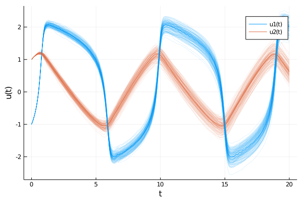

# ProbNumDiffEq.jl
_Probabilistic numerical methods for ordinary differential equations._

ProbNumDiffEq.jl is a library for [probabilistic numerical methods](http://probabilistic-numerics.org/) for solving differential equations.
It provides drop-in replacements for classic ODE solvers from [DifferentialEquations.jl](https://docs.sciml.ai/stable/) by extending [OrdinaryDiffEq.jl](https://github.com/SciML/OrdinaryDiffEq.jl).


## Installation
The package can be installed directly from github:
```julia
] add https://github.com/nathanaelbosch/ProbNumDiffEq.jl
```


## Getting Started
If you are unfamiliar with DifferentialEquations.jl, check out the
[official tutorial](https://docs.sciml.ai/stable/tutorials/ode_example/)
on how to solve ordinary differential equations.

### Step 1: Defining a problem
First, we set up an `ODEProblem` to solve the
[Fitzhugh-Nagumo model](https://en.wikipedia.org/wiki/FitzHugh%E2%80%93Nagumo_model).
```@example 1
using ProbNumDiffEq

function fitz(u, p, t)
    a, b, c = p
    return [c*(u[1] - u[1]^3/3 + u[2])
            -(1/c)*(u[1] -  a - b*u[2])]
end

u0 = [-1.0; 1.0]
tspan = (0., 20.)
p = (0.2,0.2,3.0)
prob = ODEProblem(fitz, u0, tspan, p)
nothing # hide
```

### Step 2: Solving a problem
Currently, ProbNumDiffEq.jl implements two probabilistic numerical methods: `EK0` and `EK1`.
In this example we solve the ODE with the default `EK0`, for high tolerance levels.
```@example 1
sol = solve(prob, EK0(), abstol=1e-1, reltol=1e-2)
nothing # hide
```

### Step 3: Analyzing the solution
Just as in DifferentialEquations.jl, the result of `solve` is a solution object, and we can access the (mean) values and timesteps as usual
```@repl 1
sol[end]
sol.u[5]
sol.t[8]
```

However, the solver returns a _probabilistic_ solution, here a Gaussian distribution over solution values.
These can be accessed similarly, with
```@repl 1
sol.pu[end]
sol.pu[5]
```

By default, the posterior distribution can be evaluated for arbitrary points in time `t` by treating `sol` as a function:
```@repl 1
sol(0.45)
```

#### Plotting Solutions
Finally, we can conveniently visualize the result through [Plots.jl](https://github.com/JuliaPlots/Plots.jl):
```@example 1
using Plots
plot(sol)
savefig("./figures/fitzhugh_nagumo.svg"); nothing # hide
```



## References
Gaussian ODE Filters:
- M. Schober, S. Särkkä, and P. Hennig: **A Probabilistic Model for the Numerical Solution of Initial Value Problems**
- H. Kersting, T. J. Sullivan, and P. Hennig: **Convergence Rates of Gaussian Ode Filters**
- F. Tronarp, H. Kersting, S. Särkkä, and P. Hennig: **Probabilistic Solutions To Ordinary Differential Equations As Non-Linear Bayesian Filtering: A New Perspective**
- F. Tronarp, S. Särkkä, and P. Hennig: **Bayesian ODE Solvers: The Maximum A Posteriori Estimate**
- N. Bosch, P. Hennig, F. Tronarp: **Calibrated Adaptive Probabilistic ODE Solvers**
- N. Krämer, P. Hennig: **Stable Implementation of Probabilistic ODE Solvers**

Probabilistic Numerics:
- [http://probabilistic-numerics.org/](http://probabilistic-numerics.org/)
- P. Hennig, M. A. Osborne, and M. Girolami: **Probabilistic numerics and uncertainty in computations**
- C. J. Oates and T. J. Sullivan: **A modern retrospective on probabilistic numerics**
